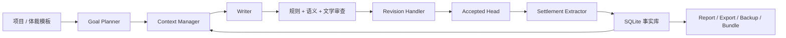

<div align="center">
  

  <h1>Songyan（松烟）</h1>

  <p><strong>面向中文长篇小说创作的工程化 AI 写作系统</strong></p>
  <p><em>规划故事，生成章节，审查事实，沉淀长期记忆。</em></p>

  <p>
    <a href="https://www.python.org/">= 3.11" /></a>
    <a href="LICENSE"></a>
    <a href="https://github.com/Bingtuu/Songyan/actions/workflows/ci.yml"></a>
    <a href="https://github.com/astral-sh/ruff"></a>
    
    
  </p>
</div>

---

Songyan 是一个本地优先的 Python CLI 项目，用于把 AI 长篇中文小说创作变成可持续、可审计、可恢复的工程流程。

它不是“一次提示词生成一章”的玩具，而是一条完整的创作流水线：

```text
规划故事 -> 组装上下文 -> 生成初稿 -> 规则/语义/文学审查 -> 修订 -> 接收 -> 抽取事实 -> 写入 SQLite
```

模型负责写正文；Songyan 负责长期记忆、事实校验、版本管理、失败恢复和诊断证据。

## 为什么需要 Songyan

中文长篇小说创作的难点不只是“写出一章”，而是“写到第 200 章时仍然记得第 3 章发生了什么”。Songyan 围绕这个问题设计：

| 长篇创作问题 | Songyan 的处理方式 |
|--------------|--------------------|
| 上下文越来越长 | 分层摘要、角色聚焦、设定蒸发、预算保护 |
| 人物和设定漂移 | SQLite 长期事实库 + 正文证据结算 |
| 质量判断不稳定 | 规则审查、语义审查、文学诊断、质量门 |
| 长跑中途失败 | run log、断点续跑、失败恢复建议、诊断包 |
| 项目难以迁移 | backup / restore 保存可恢复资产 |
| 运行参数误改 | profile validate、dry-run、history、rollback |

## 当前状态

Songyan 目前适合懂命令行、能配置 LLM API key 的技术用户试用。正式发布标签前，维护者仍应在目标 release commit 上重新执行 [Release Checklist](docs/release-checklist.md)，并补充真实 LLM Ch1-3 smoke 结果。

已完成的项目级验证包括：

- 科幻长窗口 baseline 已冻结在 200+ 章规模。
- 玄幻、武侠、都市样本完成 200 章 accepted 内部验证。
- Windows 下通过 wheel 构建、wheel 安装、非仓库目录运行、资源加载、模板建项和 accepted 正文导出 smoke。
- CI 覆盖 ruff、runtime mypy、pytest、CLI tests 和 wheel smoke。

## 功能概览

| 模块 | 能力 |
|------|------|
| 项目创建 | 从内置体裁模板一键创建小说项目 |
| 多体裁运行时 | 内置科幻、玄幻、武侠、都市等体裁配置 |
| 单章流水线 | 规划、写作、审查、修订、接收、事实结算 |
| 长期记忆 | 用 SQLite 保存项目、章节、版本、设定、角色状态和运行日志 |
| 版本追溯 | draft / revision / accepted 版本全部 append-only |
| 上下文控制 | 动态预算、分层摘要、角色聚焦和 ContextEmergency |
| 失败恢复 | 对配置、DB、preflight、run、report、export、restore 提供恢复建议 |
| 诊断工具 | `doctor`、`report`、脱敏 `bundle-run`、成本和质量信号 |
| 资产生命周期 | `backup` / `restore` 保存和恢复项目资产 |
| Profile 安全 | `validate`、`upsert --dry-run`、`history`、`rollback` |
| 正文导出 | 从 accepted 章节导出 Markdown / txt 书稿 |

## 快速开始

### 环境要求

- Python 3.11+
- DeepSeek API Key，或其他兼容 OpenAI 接口的 LLM endpoint
- 可写的本地目录，用于 SQLite DB、日志和导出文件

### 开发安装

```powershell
python -m pip install -e ".[dev]"
Copy-Item .env.example .env
```

编辑 `.env`：

```dotenv
LLM_API_KEY=your-api-key
LLM_BASE_URL=https://api.deepseek.com
LLM_MODEL=deepseek-chat
DATABASE_URL=sqlite:///songyan.db
CHECKPOINTER_MODE=sqlite
```

Windows 本地 smoke 或短窗口验证时，可以先使用：

```dotenv
CHECKPOINTER_MODE=memory
```

### 最短闭环

```powershell
# 检查配置、资源和 SQLite schema
songyan doctor --init-db

# 从内置模板创建项目
songyan create-project --template scifi

# 使用 create-project 输出的 project_id
songyan run --project-id <project_id> --chapters 1-3 --auto-confirm

# 使用 run 输出的 run_id
songyan report --run-id <run_id>
songyan bundle-run --run-id <run_id> --output bundles/

# 导出 accepted 正文
songyan export --project-id <project_id> --chapters 1-3 --format md --output exports/

# 备份项目资产
songyan backup --project-id <project_id> --output backups/
```

更完整的安装、配置、10 章教程和恢复入口见 [Quickstart](docs/quickstart.md)。

## 常用命令

| 命令 | 作用 |
|------|------|
| `songyan doctor --init-db` | 检查环境并初始化 / 迁移 SQLite |
| `songyan create-project --template <id>` | 从内置模板创建项目 |
| `songyan list-projects` | 列出本地项目 |
| `songyan run --project-id <id> --chapters 1-3 --auto-confirm` | 运行短窗口生成 |
| `songyan report --run-id <run_id>` | 从 JSONL run log 生成报告 |
| `songyan bundle-run --run-id <run_id> --output bundles/` | 生成脱敏诊断包 |
| `songyan export --project-id <id> --format md --output exports/` | 导出 accepted 正文 |
| `songyan backup --project-id <id> --output backups/` | 备份可恢复项目资产 |
| `songyan restore --backup <zip> --database-url sqlite:///restored.db` | 从备份恢复 SQLite 事实库 |
| `songyan profile validate --genre <genre> --json` | 校验当前体裁运行时 profile |
| `songyan profile upsert --genre <genre> --set key=value --dry-run` | 预览 profile override，不写 DB |
| `songyan profile history --genre <genre>` | 查看 profile 修改历史 |
| `songyan profile rollback --genre <genre> --history-id <id>` | 回滚 profile override |

## 架构概览



核心目录：

| 路径 | 作用 |
|------|------|
| `src/songyan/agents/` | 规划、写作、审查、修订、事实结算 Agent |
| `src/songyan/workflows/` | 单章与多章运行编排 |
| `src/songyan/db/` | SQLite schema、migration 和 repository |
| `src/songyan/services/` | 面向 CLI 的 doctor、export、backup、bundle、profile 服务 |
| `src/songyan/genres/` | 内置体裁配置 |
| `src/songyan/project_templates/` | 内置项目模板 |
| `src/songyan/prompts/` | 版本化 prompt cards |
| `tests/` | 单元、集成和 CLI 测试 |
| `docs/` | 公开用户与贡献文档 |

## 文档

- [Status](docs/STATUS.md)：当前可用性、已验证项和限制
- [Quickstart](docs/quickstart.md)：安装、配置、运行和导出
- [Troubleshooting](docs/troubleshooting.md)：常见失败与恢复命令
- [Release Checklist](docs/release-checklist.md)：维护者发布清单
- [Minimal Reproduction Guide](docs/minimal-repro.md)：如何提交可复现问题
- [Documentation Index](docs/INDEX.md)：公开文档导航
- [Changelog](CHANGELOG.md)：版本变更记录
- [Contributing](CONTRIBUTING.md)：贡献方式和工程边界

## 开发

提交 PR 前建议运行：

```powershell
python -m pytest tests/ -q
python -m pytest tests/cli -q
ruff check src/ tests/
mypy src/
python -m pip wheel . --no-deps -w dist
```

Windows 下长跑或测试卡住时，可以用硬超时 wrapper：

```powershell
powershell -File scripts/run_with_timeout.ps1 -TimeoutSec 900 -- python -m pytest tests/ -q
```

核心工程边界：

- SQLite 是长期事实源。
- 章节版本 append-only，不覆盖历史版本。
- Agent 不直接写 DB connection；写入走 repository / service 边界。
- Prompt cards 放在包资源中，不在代码里硬编码长 prompt。
- research / report-only 信号不进入 runtime prompt、CED、T9 或 hard gate。

## 安全与隐私

不要提交 `.env`、API key、私密书稿、local DB、未脱敏日志、backup 或 bundle。

提交 run 失败问题时，优先使用脱敏诊断包：

```powershell
songyan bundle-run --run-id <run_id> --output bundles/
```

更多信息见 [Minimal Reproduction Guide](docs/minimal-repro.md)。

## License

Songyan 使用 [AGPL-3.0](LICENSE) 许可证。
