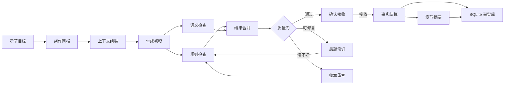
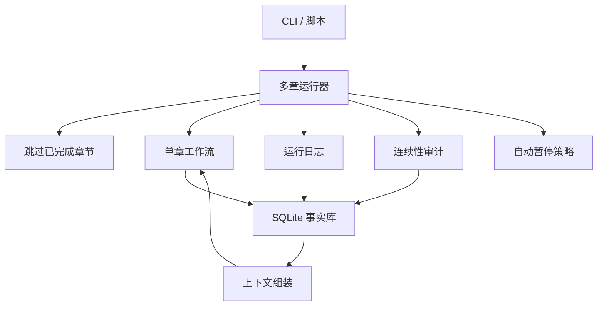
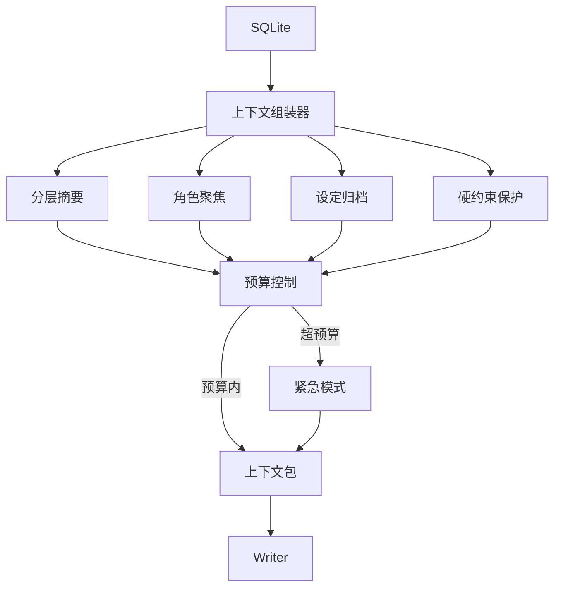

<div align="center">
  

  <h1>Songyan（松烟）</h1>

  <p><strong>用 AI 写长篇中文小说的工程化方案</strong></p>
  <p><em>松烟入墨，字句成锋。</em></p>

  <p>
    <a href="https://www.python.org/">= 3.11" /></a>
    <a href="LICENSE"></a>
    <a href="https://github.com/Bingtuu/Songyan/actions/workflows/ci.yml"></a>
    <a href="https://github.com/astral-sh/ruff"></a>
  </p>
</div>

---

## 目录

- [这是什么？](#这是什么)
- [核心设计](#核心设计)
- [架构概览](#架构概览)
- [当前能力](#当前能力)
- [项目结构](#项目结构)
- [快速开始](#快速开始)
- [CLI 命令参考](#cli-命令参考)
- [技术栈](#技术栈)
- [路线图](#路线图)
- [定制与接入新体裁](#定制与接入新体裁)
- [可定制接口一览](#可定制接口一览)
- [开发与贡献](#开发与贡献)
- [常见问题](#常见问题)
- [开发文档](#开发文档)
- [许可证](#许可证)

---

## 这是什么？

Songyan 是一套把 AI 写长篇中文小说这件事变得**可持续、可验证、可复现**的工程方案。

它不是一次调用模型生成一章就结束，而是把写作拆成一条流水线：**规划 → 生成 → 审查 → 修订 → 确认 → 记忆**。每一章都要先通过多层质量检查，再被“拆解”成角色状态、世界设定、伏笔线索等事实，存入一个长期事实数据库。这样写到第 200 章时，系统仍然知道第 3 章发生了什么，而不是靠模型自己回忆。

目前已经在以下体裁上完成长窗口验证：

- **科幻**：稳定跑到 220 章；
- **玄幻、武侠**：各完成 100 章中篇爬坡；
- **都市**：短距验证完成，Ch100 中篇爬坡完成，100/100 accepted，five-gate PASS，T9=0。

系统内置科幻、玄幻、武侠、都市等 7 种体裁模板，新增体裁只需要写配置文件，不必改核心逻辑。

### 它解决什么问题？

直接用模型写长篇，通常会遇到三个坑：

1. **写到后面忘了前面**：模型上下文有限，几十章后关键伏笔和角色关系就模糊了。
2. **质量越来越飘**：没有外部约束，文风、设定、角色行为会随机走样。
3. **事实靠不住**：模型会“顺口”改设定、改角色状态，但没法证明这是不是前后一致。

Songyan 的解法是**把“写正文”和“管事实”分开**：正文可以自由发挥，但写入长期事实库的数据必须有正文证据、有校验规则。每一章的事实基础都可追溯、可回放。

---

## 核心设计

### 1. 先写稿，再验事实

大多数 AI 写作工具把模型输出当最终结果。Songyan 把它当**候选材料**：

```
生成正文
    ↓
规则检查 + 语义检查 → 自动修订（最多两轮）
    ↓
人工/自动确认接收
    ↓
从正文中提取并校验：
  - 角色状态变化（旧值必须和数据库当前值对得上）
  - 新设定（必须有正文原文作为证据）
  - 伏笔（记录来源章节，方便后续追踪兑现）
  - 关键数字（公式必须闭合）
    ↓
写入 SQLite 长期事实库
```

一句话：**模型负责创意，系统负责记账和核对。**

### 2. 聪明的上下文压缩

长篇最怕上下文爆炸。Songyan 用四种手段把历史信息控制在合理范围：

| 手段 | 做法 | 效果 |
|------|------|------|
| 分层摘要 | 最近几章保留细节，远期压缩成弧/卷摘要 | 历史信息从线性增长变成对数增长 |
| 角色聚焦 | 主角和当前出场角色保留完整档案，长期不出场的角色逐步降级 | 控制角色池膨胀 |
| 设定归档 | 低置信度、长期未使用的设定自动归档 | 防止设定越积越多 |
| 硬上限保护 | 预算超限时进入紧急模式，只保留不可裁剪的核心约束 | 绝对兜底 |

### 3. 多层把关，不止一个评分

Songyan 不把质量判断交给单一模型，而是分四层：

- **规则层**：用代码做确定性检查——字数、Markdown 泄漏、段落重复、AI 腔特征词等。有就是有，没有就是没有。
- **语义层**：用模型判断角色行为一致性、叙事节奏、信息密度等。关键问题必须附带正文证据。
- **文学诊断**：识别角色工具化、概念空转、过度平滑等文学性问题，只诊断、不阻塞。
- **质量门**：规则层和语义层的结果合并后统一判断——通过则接收，可修复则自动修订，修不好则停下来等人。

### 4. 每个版本都存档

每次生成、修订、重写、人工编辑都会创建一条新记录，**不存在“覆盖”**。这意味着：

- 任何版本都可以回溯；
- 质量下降时可以回退到安全版本；
- 谁在什么时候改了什么，都有审计链。

### 5. 跑长了也能停能续

长篇生成可能跑几个小时。Songyan 支持：

- 中途 kill 后用 `--resume` 从断点继续；
- 自动跳过已接收的章节；
- 单章失败不阻塞整体，失败章被隔离记录；
- 检测到真实质量退化时自动暂停，人工判断后继续。

---

## 架构概览

### 单章工作流

每一章都要走完整闭环：



### 多章运行



### 上下文管理



---

## 当前能力

Songyan 已经过科幻 220 章、玄幻 100 章、武侠 100 章、都市 100 章的长窗口验证。以下能力均已在这些验证样本中跑通：

| 能力 | 说明 |
|------|------|
| 长篇连续生成 | 科幻 220/220 章、玄幻 100/100 章、武侠 100/100 章、都市 100/100 章连续跑通 |
| 多体裁可插拔 | 科幻、玄幻、武侠、都市等 7 种体裁共用同一套流程；新增体裁只需写配置文件，不改核心逻辑 |
| 文本洁净 | 已验证样本中无 Markdown 泄漏、无段落重复、无 AI 保护指令混入正文 |
| 事实一致性 | 角色状态、世界设定、关键数值都可追溯到正文证据 |
| 跨体裁一致性审计 | 只统计有正文证据的关键/严重问题，跨体裁公平比较 |
| 跨章连续性 | 孤立设定和遗忘伏笔自动检测；连续性评分全程稳定 |
| 上下文控制 | 智能压缩让 220+ 章生成不溢出上下文窗口 |
| 断点续跑 | kill 后 `--resume` 继续，自动跳过已完成章节 |
| 正文导出 | `songyan export` 从接收版本导出纯净书稿，支持 Markdown/txt 与 flat/arc/volume 分组 |
| 自适应暂停 | 正常波动不误伤，真实质量退化时自动暂停 |
| 叙事骨架 | 全书大纲 → 弧规划 → 章节目标自顶向下派生 |
| 伏笔调度 | 长程伏笔主动兑现，不同体裁可设不同回收窗口 |
| 文学护栏 | 配角目标、主动选择、概念预算等在创作和审查中双重约束 |
| 项目模板化 | 一键从体裁模板创建完整项目骨架 |
| 都市体裁爬坡 | 短距验证 15/15 通过；Ch100 已 100/100 accepted，five-gate PASS，segment audit PASS，T9=0 |

> 最新验证数据和进展见 [`docs/STATUS.md`](docs/STATUS.md)。

---

## 项目结构

```text
songyan/
├── src/songyan/
│   ├── agents/              # 写作与审查模块（Writer / 审查 / 修订 / 事实结算等）
│   │   ├── context_manager/        # 上下文组装与预算控制
│   │   ├── creative_director/      # 创作简报与章节策略
│   │   ├── revision_handler/       # 局部修订、分段修订、安全回退保护
│   │   └── settlement_extractor/   # 事实结算、证据校验、设定追踪
│   ├── workflows/           # 单章闭环 + 多章运行器
│   ├── db/                  # SQLite schema、repository、迁移
│   ├── models/              # Pydantic v2 数据模型
│   ├── evals/               # 质量度量、文学诊断、护栏审计
│   ├── genres/data/         # 体裁 Profile JSON（scifi/xuanhuan/wuxia/urban 等 7 种）
│   ├── creative_modes/data/ # 创作模式 Profile JSON（4 种）
│   ├── prompts/cards/       # 模块工艺卡（YAML 版本化）
│   ├── prompts/literary_plugins/ # 文学策略插件
│   ├── project_templates/data/   # 项目模板、seed、outline 与 schema
│   └── llm/                 # LLM 调用、重试、结构化输出
├── evals/seeds/             # 评测 seed 与种子章节
├── tests/                   # 单元 / 集成 / E2E / 长序列测试
├── docs/                    # 状态、架构文档、报告
└── archive/                 # 历史资料
```

---

## 快速开始

### 环境要求

- Python >= 3.11
- DeepSeek API Key（或兼容 OpenAI 接口的 LLM）
- 磁盘空间：100 章数据库约 100MB，200 章约 160MB

### 安装

```bash
pip install -e ".[dev]"
cp .env.example .env
# 编辑 .env，填入 LLM_API_KEY
```

### 配置

`.env` 关键配置项（完整模板见 [`.env.example`](.env.example)）：

| 变量 | 默认 | 说明 |
|------|------|------|
| `LLM_API_KEY` | — | **必填**。LLM API Key |
| `LLM_BASE_URL` | `https://api.deepseek.com` | 兼容 OpenAI 接口的任意端点 |
| `LLM_MODEL` | `deepseek-chat` | 模型名 |
| `LLM_TEMPERATURE` | `0.7` | 生成温度 |
| `CONTEXT_TOTAL_BUDGET` | `32000` | 上下文总 token 预算 |
| `DATABASE_URL` | `sqlite:///songyan.db` | 事实库路径 |
| `CHECKPOINTER_MODE` | `sqlite` | checkpoint 持久化；Windows 测试环境建议 `memory` |
| `LOG_LEVEL` | `INFO` | console 应用日志级别 |
| `LOG_FILE_LEVEL` | `DEBUG` | `logs/app/*.jsonl` 文件日志级别 |
| `SONGYAN_FORCE_EXIT` | `0` | 结果落盘后的进程退出兜底；CLI 默认关闭，长跑默认开启 |
| `SONGYAN_RUN_COST_BUDGET` | `0` | 单 run LLM 成本预算（¥）；0=不启用，超预算熔断暂停，可 `--resume` 续跑 |

### 创建项目并生成

```bash
# 从体裁模板创建项目（支持 scifi/xuanhuan/wuxia/urban 等 7 种）
songyan create-project --template xuanhuan

# 生成第 1-5 章（自动确认模式）
songyan run --project-id <id> --chapters 1-5 --auto-confirm

# 断点续跑
songyan run --project-id <id> --chapters 1-100 --auto-confirm --resume

# 导出接收版本的书稿
songyan export --project-id <id> --by arc --format md --output exports/
```

### 长跑脚本示例

```bash
# 初始化 DB + 从模板创建项目（模板由 TEMPLATE_ID 环境变量指定）
$env:TEMPLATE_ID = "xuanhuan"
$env:RUN_ID = "demo"
$env:CHECKPOINTER_MODE = "sqlite"
$env:SONGYAN_RUN_COST_BUDGET = "25.0"
python scripts/run_172b_ch100_climb.py --init

# 无人值守跑 Ch1-Ch100（分段爬坡，自动 resume）
python scripts/run_172b_ch100_climb.py --to 100
```

脚本会按模板写入固定路径：数据库 `.tmp/task172b_<template>_ch100.db`，项目信息 `.tmp/task172b_<template>_project.json`。Windows 长跑建议通过 `scripts/run_with_timeout.ps1` 包一层硬超时，避免终端或第三方库挂住。

---

## CLI 命令参考

| 命令 | 作用 |
|------|------|
| `songyan create-project [--template <id>] [--outline-file <path>]` | 交互式或从体裁模板创建项目 |
| `songyan list-projects` | 列出所有项目 |
| `songyan run --project-id <id> --chapters 1-10 [--auto-confirm] [--resume] [--run-id <id>] [--mode-id <mode>] [--gate-mode observe|enforce] [--on-failure abort|retry|isolate] [--rag-mode auto|always|never] [--skip-rag]` | 生成指定章节范围；默认回读项目 `mode_id`，显式 `--mode-id` 覆盖；成功后输出 `run_id` |
| `songyan export --project-id <id> [--format md|txt] [--by flat|arc|volume] [--chapters 1-100]` | 从接收版本导出纯净书稿 |
| `songyan report --run-id <id>` | 流式验证报告（含 LLM 成本视图） |
| `songyan doctor [--json] [--check-llm] [--init-db]` | 本地环境自检；默认只读无成本 |
| `songyan index --project-id <id> [--chapters 1-10 或 3,5,7] [--rebuild]` | 为接收章节建立或重建 RAG 向量索引 |
| `songyan metrics` | 质量度量指标 |
| `songyan mark add/list/remove/update-priority` | 人工标记（continuity 修复提示）管理 |

完整参数以 `songyan <command> --help` 为准。

---

## 技术栈

| 组件 | 选型 | 选型理由 |
|------|------|----------|
| 语言 | Python 3.11+（async/await） | 适合 IO 密集型 LLM 调用 |
| 工作流 | LangGraph | 把单章闭环建模为状态机，天然支持断点续跑 |
| 数据模型 | Pydantic v2 | 严格校验，类型安全 |
| 事实库 | SQLite + aiosqlite | 零运维、本地可审计、足够支撑 200+ 章 |
| LLM 接入 | LiteLLM | 一端接入，可切多家模型 |
| CLI | Click | 命令行体验稳定 |
| 日志 | structlog | 结构化日志，便于事后重建现场 |
| 测试 | pytest、ruff、mypy | 默认测试 + CLI 测试 + 类型检查 |

---

## 路线图

| 阶段 | 状态 | 内容 |
|------|------|------|
| V5 | ✅ 完成 | 支撑长篇生成，Ch1-Ch150 150/150 通过 |
| V6 | ✅ 完成 | 叙事骨架、长篇质量度量、无人值守长跑底盘 |
| V7 | ✅ 完成 | 可生产化，sci-fi 单一体裁 Ch200 达成 |
| V8 | ✅ 完成 | 多体裁可插拔 + xuanhuan/wuxia Ch100 通过 |
| V8.5 | ✅ 完成 | 验收后遗留收口：预算上限修复、C 判据三档证据闭环、文档治理 |
| V9 | ✅ 完成 | 生产化地基（长跑可靠性/导出/打包/CI/成本追踪/质量门工具收编）+ urban 第三体裁 Ch100；urban Ch1-Ch100 100/100 accepted，five-gate PASS，segment audit PASS，T9=0；任务文档已归档 `archive/v9/` |
| V10 | ◐ V10.2 Task 192.ad blocker 待修复 | 跨体裁 Ch200、优秀度信号包、结构升级 spike；Task 189 已冻结 sci-fi Ch200 baseline，Task 190 已完成 Ch100 终点事实源盘点，Task 191 已完成 Ch200 harness 准备，Task 192.p/q/r/s/t/u/v/w/x/y/z/aa/ab/ac 已完成，xuanhuan Ch200 target 已到 Ch111（111/111 accepted，failed=[]），Ch111 后触发 `health_low_streak_halt`，修复前不得继续 Ch112/125 |

各阶段事实入口见 [`tasks/V10-README.md`](tasks/V10-README.md)（当前 V10.2 Task 192 xuanhuan Ch200 climb 入口）以及 `tasks/V5-README.md`、`tasks/V6-README.md`、`tasks/V7-README.md`、`tasks/V8-README.md`、`tasks/V9-README.md`（均已收尾）；V5-V9 单项任务文档与报告分别归档在 [`archive/v5/`](archive/v5/INDEX.md)、[`archive/v6/`](archive/v6/INDEX.md)、[`archive/v7/`](archive/v7/INDEX.md)、[`archive/v8/`](archive/v8/INDEX.md)、[`archive/v9/`](archive/v9/INDEX.md)。

---

## 定制与接入新体裁

V8 已验证出一条可复制的体裁接入路径：先用短距验证确认新体裁是否达到科幻同级质量，再选择通过的体裁推进到 Ch100。接入新体裁**不需要改核心逻辑**，差异全部收敛到三种配置文件；未知体裁自动 100% 回退科幻已验证行为。

### 三种配置文件

| 层 | 位置 | 管什么 |
|----|------|--------|
| 体裁内容画像 | `src/songyan/genres/data/<genre>.json` | 节奏规则、写作规则、疲劳词、禁忌、审查关注点、文学护栏关键词 |
| 运行时画像 | 代码注册表 `src/songyan/db/genre_runtime_profile_repo.py` + DB `genre_runtime_profiles` 表 | 上下文预算、暂停阈值、伏笔回收窗口、角色聚焦窗口、连续性容差 |
| 项目模板 | `src/songyan/project_templates/data/<genre>/` | 主角设定、核心钩子、叙事骨架、种子章节 |

加载语义：代码注册表是体裁基线（含实证调校），DB 记录是**字段级覆盖层**——调参时可以不改代码，往 DB 写入一条只含差异字段的记录即可；嵌套子模型按整体替换。未知体裁回退科幻基线。

### 推荐流程（V8 实证路径）

**1. 写配置**。参照 `src/songyan/genres/data/xuanhuan.json` 与 `src/songyan/project_templates/data/xuanhuan/` 补齐三种配置；运行时画像先不写，用科幻默认值起跑。

**2. 短距验证**（第一次必跑，是对标手段不是终点）：

```bash
python scripts/run_172a7_genre_validation.py --templates <genre> --end 10
```

达标线（与科幻同标，不放宽）：10/10 通过、无异常暂停、上下文预算不超标、文本洁净、时间线与设定一致性无严重问题。`--end 15` 再跑一轮确认。

**3. 撞墙诊断与调参**（V8 撞过的三面墙，按信号路由）：

| 信号 | 根因（V8 实证） | 正确杠杆 |
|------|----------------|----------|
| 上下文预算连续吃紧 | 溢出发生在不可裁剪核心（体裁规则等硬约束），分区权重压不动 | 抬 `base_budget`（xuanhuan 标定到 15000）或精简体裁规则内容本身；**不要调分区权重** |
| 伏笔长期未回收 | 先确认回收机制生效；LLM 埋的回收窗口天然偏短 | 按实测种植密度设回收窗口（wuxia=48 / xuanhuan=48） |
| 一致性热点章节 | 多轮修订章密度最高 | 热点章定点修订；高状态密度体裁可放宽角色加载量 |

**4. 科幻回归**（任何运行时改动必跑）：`--templates scifi --end 10`，确认无运行时画像体裁旧行为不变。

**5. 中篇爬坡**。短距验证全绿后，复用 Ch100 爬坡脚本分段推进（25 章一段 = 弧边界，段边界质量门 early-warning，撞墙即停不硬跑）：

```bash
$env:TEMPLATE_ID = "<genre>"; $env:RUN_ID = "<run-id>"
$env:CHECKPOINTER_MODE = "sqlite"
$env:SONGYAN_RUN_COST_BUDGET = "25.0"
python scripts/run_172b_ch100_climb.py --init
python scripts/run_172b_ch100_climb.py --to 100
```

该 harness 使用固定路径 `.tmp/task172b_<genre>_ch100.db`，不会因为外部 `DATABASE_URL` 改变爬坡库；`DATABASE_URL` 仅在后续手动审计、metrics 或 profile 检查时临时指向目标库。

终判口径（冻结）：Ch1-Ch100 全通过、上下文预算峰值 < 1.0、文本洁净无硬问题、关键/严重一致性问题有正文证据、未回收伏笔不超过科幻同章尺度、连续性评分 ≥ 8.0。对标基线与质量门细节见 [`archive/v8/tasks/172b-xuanhuan-ch100-climb.md`](archive/v8/tasks/172b-xuanhuan-ch100-climb.md) §1.1。

---

## 可定制接口一览

体裁之外，系统的这些部分也是为「可替换」设计的。全部通过配置文件扩展，不需要改核心代码：

| 接口 | 位置 | 能定制什么 | 怎么用 |
|------|------|-----------|--------|
| **创作模式** | `src/songyan/creative_modes/data/<mode>.json` | 启用哪些写作/审查模块、审查维度与权重、修订策略、容差阈值、RAG 配置、人工记忆、成功指标 | 新增一个 JSON 文件即注册；`songyan run --mode-id <mode>` 选用。现有 webnovel / webnovel_intense / literary / hybrid 四种可参考 |
| **工艺卡（prompt）** | `src/songyan/prompts/cards/<agent>/<version>.yaml` + `_manifest.yaml` | 任一模块的 system prompt | 版本化新增，`_manifest.yaml` 切 `default_version` 生效 |
| **文学策略插件** | `src/songyan/prompts/literary_plugins/<strategy>/<agent>.yaml` | 按策略向指定 prompt 注入片段（如声纹锚定、AI 腔黑名单） | 新建 `<strategy>/` 目录放 `<agent>.yaml`，在创作模式 JSON 中引用策略 id |
| **LLM 端点** | `.env` | 模型提供方、模型名、温度 | 改 `LLM_BASE_URL` / `LLM_MODEL` 即可 |
| **质量门模式** | `GateConfig.for_mode(...)` | `observe`（只观测不拦截）/ `enforce`（生产拦截） | 脚本入口传入；长跑验证先用观测模式看信号，再切拦截模式 |

### 定制边界（有意不开放）

以下不是遗漏，而是设计上的有意封闭，绕过它们会破坏系统根基：

- **模块边界与工作流结构**——“写正文”和“管事实”分离是根基，不开放新增/改写节点；
- **结算写入与事务路径**——事实库只接受有证据、可验证的数据；
- **冻结验收口径**——科幻基线、一致性审计口径、质量门判定标准；口径可调则跨体裁对标失去意义。

### 已知缺口（欢迎贡献）

这些机制已在代码里，但离「开箱即用」还差一层包装，是当前最欢迎的贡献方向：

- 文学插件目录缺清单/版本/校验注册机制（工艺卡的 manifest 是现成参照）。

---

## 开发与贡献

### 工程纪律

本仓库的开发规范与不可违背规则（数据与状态、模块边界、审查与修订、状态结算、上下文压缩）见 [`AGENTS.md`](AGENTS.md)。提交代码前请确认了解：

- SQLite 是唯一长期事实源；工作流状态只存 ID，不存正文；
- 每次生成/修订必须创建 `chapter_versions` 新记录，禁止覆盖；
- 写操作集中在 Service/UnitOfWork，写作模块不直接拿 DB connection；
- 新功能/修复遵循 TDD：先写失败测试，再实现。

### 验证命令

```bash
# 全量测试（默认忽略 tests/evals 与 tests/cli，约 15 分钟）
python -m pytest tests/ -q

# CLI 测试（CI 单独覆盖）
python -m pytest tests/cli -q

# 代码检查
ruff check src/ tests/

# 类型检查
mypy src/
```

### 多体裁回归

任何运行时契约改动必须通过科幻短距验证回归，保证无运行时画像体裁旧行为不变：

```bash
python scripts/run_172a7_genre_validation.py --templates scifi --end 10
```

---

## 常见问题

**Q: 支持哪些 LLM？**
经 LiteLLM 接入，默认 DeepSeek；任何兼容 OpenAI 接口的端点改 `LLM_BASE_URL` / `LLM_MODEL` 即可，无需改代码。

**Q: 单章生成失败会中断长跑吗？**
不会。isolate 模式下单章失败被隔离记录，后续章节继续；检测到真实质量退化时才自动暂停，人工判断后可 `--resume` 继续。

**Q: Windows 下测试/长跑卡住怎么办？**
用防卡 wrapper（V9 Task 176）：`powershell -File scripts/run_with_timeout.ps1 -TimeoutSec 3600 -- <你的命令>`——硬超时 + 进程树清理 + 标准判定标记（`WRAPPER_RESULT=PASS_NORMAL_EXIT` 等四档），pytest 通过摘要自动识别；`CHECKPOINTER_MODE=memory` 用于测试环境。

---

## 开发文档

- [`docs/STATUS.md`](docs/STATUS.md) — 当前状态、验收证据、下一步
- [`docs/INDEX.md`](docs/INDEX.md) — 文档索引
- [`tasks/V10-README.md`](tasks/V10-README.md) — V10 规划入口（跨体裁 Ch200 + 优秀度信号包 + 结构升级 spike）
- [`tasks/189-ch200-baseline-and-checkpoints-DONE.md`](tasks/189-ch200-baseline-and-checkpoints-DONE.md) — V10 Task 189：Ch200 baseline 与 checkpoint 冻结完成报告
- [`tasks/189-scifi-ch200-baseline.json`](tasks/189-scifi-ch200-baseline.json) — V10 Task 189：sci-fi Ch200 冻结 baseline
- [`tasks/189-ch200-baseline-and-checkpoints.md`](tasks/189-ch200-baseline-and-checkpoints.md) — V10 Task 189：Ch200 baseline 与 checkpoint 冻结任务书
- [`tasks/190-ch100-terminal-source-inventory.md`](tasks/190-ch100-terminal-source-inventory.md) — V10 Task 190：Ch100 终点事实源盘点任务书
- [`tasks/190-ch100-terminal-source-inventory-DONE.md`](tasks/190-ch100-terminal-source-inventory-DONE.md) — V10 Task 190：Ch100 终点事实源盘点完成报告
- [`tasks/191-ch200-harness-preparation.md`](tasks/191-ch200-harness-preparation.md) — V10 Task 191：Ch200 harness 准备任务书
- [`tasks/191-ch200-harness-preparation-DONE.md`](tasks/191-ch200-harness-preparation-DONE.md) — V10 Task 191：Ch200 harness 准备完成报告
- [`scripts/run_v10_ch200_climb.py`](scripts/run_v10_ch200_climb.py) — V10 Task 191：Ch200 分段爬坡 harness
- [`tasks/192-xuanhuan-ch200-climb.md`](tasks/192-xuanhuan-ch200-climb.md) — V10 Task 192：xuanhuan Ch200 爬坡任务书
- [`tasks/192.p-scifi-short-regression-context-emergency-DONE.md`](tasks/192.p-scifi-short-regression-context-emergency-DONE.md) — V10 Task 192.p：scifi 短窗口 ContextEmergency 回归修复完成报告
- [`tasks/192.q-xuanhuan-ch17-creative-director-json-parse-DONE.md`](tasks/192.q-xuanhuan-ch17-creative-director-json-parse-DONE.md) — V10 Task 192.q：xuanhuan Ch17 CreativeDirector JSON parse 修复完成报告
- [`tasks/192.r-xuanhuan-ch24-settlement-numerical-validation-DONE.md`](tasks/192.r-xuanhuan-ch24-settlement-numerical-validation-DONE.md) — V10 Task 192.r：xuanhuan Ch24 settlement numerical validation 处理完成报告
- [`tasks/192.s-xuanhuan-ch50-t9-duplicate-clean-DONE.md`](tasks/192.s-xuanhuan-ch50-t9-duplicate-clean-DONE.md) — V10 Task 192.s：xuanhuan Ch50 T9 duplicate 清理完成报告
- [`tasks/192.t-xuanhuan-ch75-segment-audit-critical-orphans.md`](tasks/192.t-xuanhuan-ch75-segment-audit-critical-orphans.md) — V10 Task 192.t：xuanhuan Ch75 segment audit critical orphan 修复任务书
- [`tasks/192.t-xuanhuan-ch75-segment-audit-critical-orphans-DONE.md`](tasks/192.t-xuanhuan-ch75-segment-audit-critical-orphans-DONE.md) — V10 Task 192.t：xuanhuan Ch75 segment audit critical orphan 修复完成报告
- [`tasks/192.u-xuanhuan-ch81-health-low-p1-critical-orphan.md`](tasks/192.u-xuanhuan-ch81-health-low-p1-critical-orphan.md) — V10 Task 192.u：xuanhuan Ch81 health_low_p1 critical orphan 修复任务书
- [`tasks/192.u-xuanhuan-ch81-health-low-p1-critical-orphan-DONE.md`](tasks/192.u-xuanhuan-ch81-health-low-p1-critical-orphan-DONE.md) — V10 Task 192.u：xuanhuan Ch81 health_low_p1 critical orphan 修复完成报告
- [`tasks/192.v-xuanhuan-ch93-health-low-p1-critical-orphan.md`](tasks/192.v-xuanhuan-ch93-health-low-p1-critical-orphan.md) — V10 Task 192.v：xuanhuan Ch93 health_low_p1 critical orphan 修复任务书
- [`tasks/192.v-xuanhuan-ch93-health-low-p1-critical-orphan-DONE.md`](tasks/192.v-xuanhuan-ch93-health-low-p1-critical-orphan-DONE.md) — V10 Task 192.v：xuanhuan Ch93 health_low_p1 critical orphan 修复完成报告
- [`tasks/192.w-xuanhuan-ch99-settlement-numerical-validation.md`](tasks/192.w-xuanhuan-ch99-settlement-numerical-validation.md) — V10 Task 192.w：xuanhuan Ch99 settlement numerical validation 修复任务书
- [`tasks/192.w-xuanhuan-ch99-settlement-numerical-validation-DONE.md`](tasks/192.w-xuanhuan-ch99-settlement-numerical-validation-DONE.md) — V10 Task 192.w：xuanhuan Ch99 settlement numerical validation 修复完成报告
- [`tasks/192.x-xuanhuan-ch99-segment-audit-critical-orphans.md`](tasks/192.x-xuanhuan-ch99-segment-audit-critical-orphans.md) — V10 Task 192.x：xuanhuan Ch99 segment audit critical orphan 修复任务书
- [`tasks/192.x-xuanhuan-ch99-segment-audit-critical-orphans-DONE.md`](tasks/192.x-xuanhuan-ch99-segment-audit-critical-orphans-DONE.md) — V10 Task 192.x：xuanhuan Ch99 segment audit critical orphan 修复完成报告
- [`tasks/192.y-xuanhuan-ch105-health-low-p1-critical-orphan.md`](tasks/192.y-xuanhuan-ch105-health-low-p1-critical-orphan.md) — V10 Task 192.y：xuanhuan Ch105 health_low_p1 critical orphan 修复任务书
- [`tasks/192.y-xuanhuan-ch105-health-low-p1-critical-orphan-DONE.md`](tasks/192.y-xuanhuan-ch105-health-low-p1-critical-orphan-DONE.md) — V10 Task 192.y：xuanhuan Ch105 health_low_p1 critical orphan 修复完成报告
- [`tasks/192.z-xuanhuan-ch105-segment-audit-critical-orphans.md`](tasks/192.z-xuanhuan-ch105-segment-audit-critical-orphans.md) — V10 Task 192.z：xuanhuan Ch105 segment audit critical orphan 修复任务书
- [`tasks/192.z-xuanhuan-ch105-segment-audit-critical-orphans-DONE.md`](tasks/192.z-xuanhuan-ch105-segment-audit-critical-orphans-DONE.md) — V10 Task 192.z：xuanhuan Ch105 segment audit critical orphan 修复完成报告
- [`tasks/192.aa-xuanhuan-ch106-invalid-model-run-state-cleanup-DONE.md`](tasks/192.aa-xuanhuan-ch106-invalid-model-run-state-cleanup-DONE.md) — V10 Task 192.aa：xuanhuan Ch106 invalid model run-state 清理完成报告
- [`tasks/192.ab-xuanhuan-ch108-settlement-numerical-validation.md`](tasks/192.ab-xuanhuan-ch108-settlement-numerical-validation.md) — V10 Task 192.ab：xuanhuan Ch108 settlement numerical validation 修复任务书
- [`tasks/192.ab-xuanhuan-ch108-settlement-numerical-validation-DONE.md`](tasks/192.ab-xuanhuan-ch108-settlement-numerical-validation-DONE.md) — V10 Task 192.ab：xuanhuan Ch108 settlement numerical validation 修复完成报告
- [`tasks/192.ac-xuanhuan-ch108-segment-audit-critical-orphans.md`](tasks/192.ac-xuanhuan-ch108-segment-audit-critical-orphans.md) — V10 Task 192.ac：xuanhuan Ch108 segment audit critical orphan 修复任务书
- [`tasks/192.ac-xuanhuan-ch108-segment-audit-critical-orphans-DONE.md`](tasks/192.ac-xuanhuan-ch108-segment-audit-critical-orphans-DONE.md) — V10 Task 192.ac：xuanhuan Ch108 segment audit critical orphan 修复完成报告
- [`tasks/192.ad-xuanhuan-ch111-health-low-streak-halt.md`](tasks/192.ad-xuanhuan-ch111-health-low-streak-halt.md) — V10 Task 192.ad：xuanhuan Ch111 health_low_streak_halt 修复任务书
- [`docs/reports/192-xuanhuan-ch100-climb.md`](docs/reports/192-xuanhuan-ch100-climb.md) — V10 Task 192：xuanhuan clean Ch100 rebuild 阶段报告（Ch100 source ready）
- [`tasks/193-wuxia-ch200-climb.md`](tasks/193-wuxia-ch200-climb.md) — V10 Task 193：wuxia Ch200 爬坡任务书
- [`tasks/194-urban-ch200-climb.md`](tasks/194-urban-ch200-climb.md) — V10 Task 194：urban Ch200 爬坡任务书
- [`tasks/V9-README.md`](tasks/V9-README.md) — V9 任务事实入口（已收尾，生产化地基 + urban Ch100）
- [`archive/v5/INDEX.md`](archive/v5/INDEX.md) — V5 任务文档与报告归档索引
- [`archive/v6/INDEX.md`](archive/v6/INDEX.md) — V6 任务文档与报告归档索引
- [`archive/v7/INDEX.md`](archive/v7/INDEX.md) — V7 任务文档与报告归档索引
- [`archive/v8/INDEX.md`](archive/v8/INDEX.md) — V8 任务文档与报告归档索引
- [`archive/v9/INDEX.md`](archive/v9/INDEX.md) — V9 任务文档与证据归档索引
- [`archive/v9/187-urban-ch100-climb-execution-DONE.md`](archive/v9/187-urban-ch100-climb-execution-DONE.md) — V9 Task 187：urban Ch100 完成报告
- [`archive/v9/188-v9-closure-and-archive-DONE.md`](archive/v9/188-v9-closure-and-archive-DONE.md) — V9 Task 188：收口与归档完成报告
- [`tasks/V8-README.md`](tasks/V8-README.md) — V8 任务事实入口（已收尾）
- [`docs/reports/v8-literature-and-landscape-review.md`](docs/reports/v8-literature-and-landscape-review.md) — V8 长调研报告（体裁差异与运行时画像设计依据）
- [`archive/superpowers/INDEX.md`](archive/superpowers/INDEX.md) — 早期 Superpowers 计划/规格归档索引
- [`AGENTS.md`](AGENTS.md) — 开发规范与工程纪律

---

## 许可证

AGPL-3.0 — 详见 [`LICENSE`](LICENSE)。
