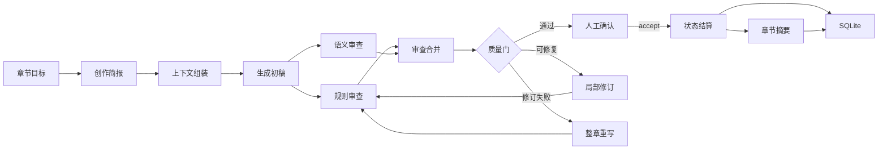
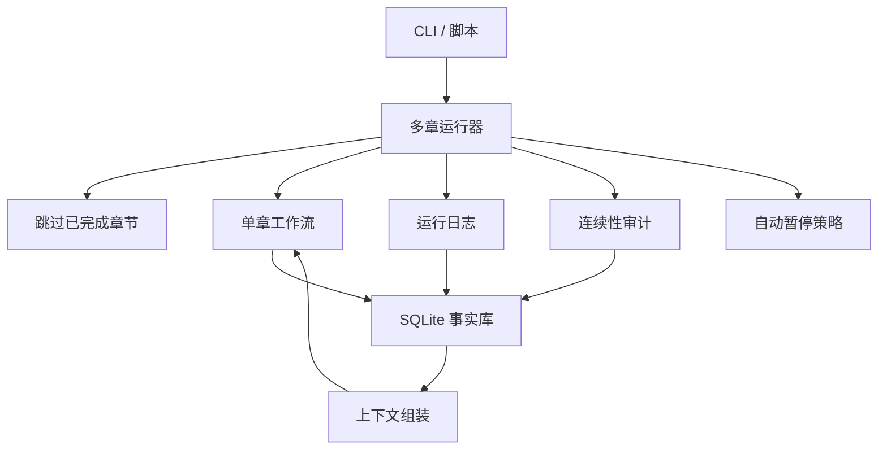
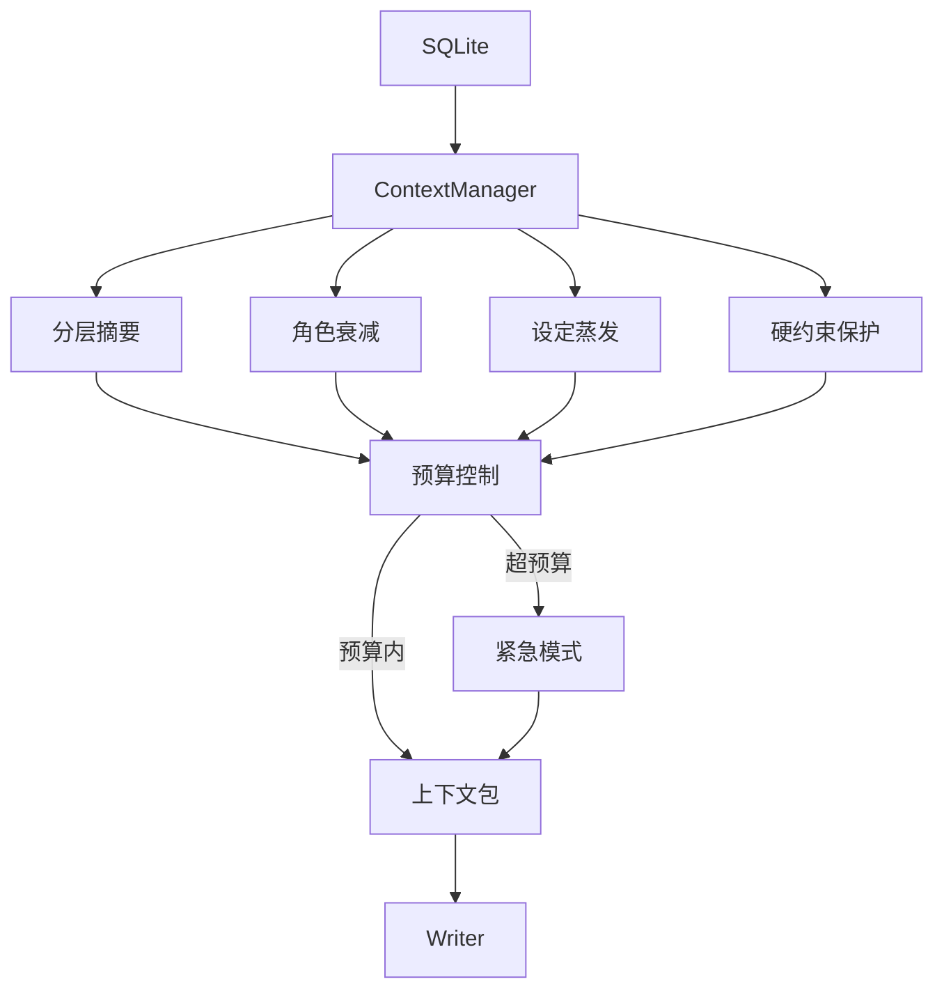

<div align="center">
  

  <h1>Songyan（松烟）</h1>

  <p><strong>多 Agent 中文长篇小说写作系统</strong></p>
  <p><em>松烟入墨，字句成锋。</em></p>

  <p>
    <a href="https://www.python.org/">= 3.11" /></a>
    <a href="LICENSE"></a>
    <a href="https://github.com/Bingtuu/Songyan/actions/workflows/ci.yml"></a>
    <a href="https://github.com/astral-sh/ruff"></a>
  </p>
</div>

---

## 目录

- [这是什么？](#这是什么)
- [核心设计](#核心设计)
- [架构概览](#架构概览)
- [当前能力](#当前能力)
- [项目结构](#项目结构)
- [快速开始](#快速开始)
- [CLI 命令参考](#cli-命令参考)
- [技术栈](#技术栈)
- [路线图](#路线图)
- [定制与接入新体裁](#定制与接入新体裁)
- [可定制接口一览](#可定制接口一览)
- [开发与贡献](#开发与贡献)
- [常见问题](#常见问题)
- [开发文档](#开发文档)
- [许可证](#许可证)

---

## 这是什么？

Songyan 是一个用多个 AI Agent 协作写中文长篇小说的系统。它不是"调用一次模型生成一章"的简单封装，而是把长篇写作拆成规划、生成、审查、修订、结算和连续性维护六个环节，每个环节由独立的 Agent 负责，共同维护一个长期事实数据库。

当前系统已在 **sci-fi 单一体裁**下稳定支持 **220 章**连续生成（220/220 accepted）。V8 阶段进一步把这套长跑能力从科幻的隐式参数中解耦，建立了可插拔的**体裁运行时画像（GenreRuntimeProfile）**：玄幻、武侠、都市短窗口 C 判据三档证据闭环（end10 / end15 / end20 全 accepted、0 halt、T9=0、overdue=0）；玄幻（xuanhuan）与武侠（wuxia）均已完成 Ch100 中篇爬坡验证（各 100/100 accepted，五门质量闸口全绿）。

这里的"五门"指：完成度、上下文预算、Consistency Error Density（CED）、未回收伏笔 overdue、continuity health。Profile 的全部运行时字段（预算分配、门禁阈值、蒸发曲线、角色衰减窗口、连续性容差）已接线到对应消费者；无 Profile 体裁 100% 回退 sci-fi 已验证行为。

### 它解决什么问题？

用单个模型直接写长篇会遇到三个核心困难：

1. **遗忘**：写到第 50 章时，模型已经不记得第 3 章发生了什么。
2. **质量漂移**：没有外部约束，文风、设定和角色行为会逐渐走样。
3. **事实不可信**：模型会"编造"角色状态变化，但无法保证前后一致。

Songyan 的做法是把"写文本"和"管事实"分开——Writer 只管生成正文，而角色状态、世界设定、伏笔线索、数字读数都由独立的结算模块从正文中提取、校验后存入 SQLite。这样，每一章的事实基础都是可追溯、可验证的。

---

## 核心设计

### 1. 生成与事实分离

这是 Songyan 最重要的设计决策。

大多数 AI 写作工具把模型输出当作最终结果。Songyan 把模型输出当作**候选材料**——正文可以自由发挥，但写入长期事实库的数据必须经过证据校验。

```
Writer 生成正文
    ↓
审查（规则 + 语义）→ 修订（最多两轮）
    ↓
人工确认 accept
    ↓
SettlementExtractor 从正文中提取：
  - 角色状态变化（old_value 必须匹配 DB 当前值）
  - 新设定（必须有正文 source_quote）
  - 伏笔（记录来源版本，后续追踪兑现）
  - 数字读数（公式闭合验证）
    ↓
写入 SQLite 长期事实库
```

这意味着：**模型可以提出候选信息，但事实库只接受有证据、可验证、可回放的数据。**

### 2. 上下文节食（Context Diet 2.0）

长篇生成的最大压力来自上下文膨胀。每写一章，历史信息就多一分，如果不加控制，prompt 会线性增长直到超出模型窗口。

Songyan 使用四组件协同控制：

| 组件 | 做法 | 效果 |
|------|------|------|
| 分层摘要 | 最近 5 章保留细节，远期压缩为弧摘要和卷摘要 | 历史信息从 O(n) 降到 O(log n) |
| 角色衰减 | 主角和当前出场角色保留完整档案；不活跃角色按未出场章数逐步降级为精简→符号→不加载 | 控制角色池膨胀 |
| 设定蒸发 | 低置信度、长期未使用的设定自动归档 | 防止设定累积 |
| 硬天花板 | 预算超限时触发紧急模式，只保留不可裁剪的硬约束 | 绝对上限保护 |

### 3. 多层审查而非单一评分

Songyan 不把质量判断交给一个模型。审查分为四层：

- **规则审查（RuleAuditor）**：代码级确定性检测——字数、Markdown 泄漏、段落重复、AI 腔特征词等。有就是有，没有就是没有。
- **语义审查（LLMAuditor）**：需要模型判断的问题——角色行为一致性、叙事节奏、信息密度。每个 critical/major issue 必须附带正文证据引用。
- **文学诊断（LiteraryAuditor）**：识别人物工具化、概念空转、过度平滑等文学性问题。只诊断，不阻塞。
- **合并与门禁（ReviewMerger + QualityGate）**：规则和语义审查结果合并后进入质量门——通过则 accept，有可修复问题则自动修订（最多两轮），修订不收敛则上报人工。

### 4. 版本不可覆盖

每次生成、修订、重写、人工编辑都会在 `chapter_versions` 表中创建新记录。不存在"覆盖"操作。这意味着：
- 任何版本都可以回溯
- 质量下降时可以回退到安全版本
- 完整审计链：谁在什么时候改了什么

### 5. 可中断、可恢复

长篇生成可能需要数小时。Songyan 支持：
- 中途 kill 后用 `--resume` 从断点继续
- 自动跳过已 accept 的章节
- 单章失败不阻塞整体（isolate 模式）
- 门禁检测到真实退化时自动暂停（AutoHalt），人工判断后继续

---

## 架构概览

### 单章工作流

每一章走完"规划 → 生成 → 审查 → 修订 → 确认 → 结算"的完整闭环：



### 多章运行



### 上下文管理



---

## 当前能力

Songyan 已经过 **sci-fi 220 章**、**xuanhuan 100 章**和 **wuxia 100 章**的长窗口验证，**urban 短窗口**质量同标也已达标。以下是已验证的关键能力：

| 能力 | 说明 |
|------|------|
| 长篇连续生成 | sci-fi 220/220 accepted；xuanhuan 100/100 accepted；wuxia clean rerun 100/100 accepted；终判运行 0 halt |
| 多体裁可插拔 | `GenreRuntimeProfile` 全部运行时字段（预算/门禁/蒸发曲线/角色衰减/连续性容差）已按体裁接线到消费者；新增体裁只需新增 Profile 文件，不修改核心逻辑；无 Profile 体裁 100% 回退旧行为 |
| 文本洁净 | 零 Markdown 泄漏、零段落重复、零 AI 保护指令进入正文 |
| 事实一致性 | 角色状态、世界设定、数值读数均可追溯到正文证据 |
| 跨体裁一致性度量 | Consistency Error Density (CED) 按 consistency-only、merged/source、正文证据口径跨体裁公平比较 |
| 跨章连续性 | 孤立设定和遗忘伏笔自动检测；health 评分全程稳定 |
| 上下文控制 | Context Diet 2.0 四组件协同（分层摘要 / 角色衰减 / 设定蒸发 / 硬天花板）支撑 220+ 章不溢出 |
| 断点续跑 | kill 后 `--resume` 继续，自动跳过已完成章节 |
| 正文导出 | `songyan export` 从 accepted head 导出纯净书稿，支持 Markdown/txt 与 flat/arc/volume 分组 |
| 自适应门禁 | 正常波动不误伤，真实退化自动暂停（AutoHalt） |
| 叙事骨架 | 全书大纲 → 弧规划 → 章节目标自顶向下派生；xuanhuan 已用 9-arc/3-thread 骨架跑完 Ch100 |
| 伏笔调度 | 长程伏笔主动兑现，按体裁设 horizon floor（xuanhuan=48 / wuxia=48）；172c.r 修复伏笔 resolve 机制，172c.s 完成 wuxia 长窗口预算/角色状态/horizon 校准，172c.t 将 wuxia health overdue 权重校准到 0.15；wuxia Ch100 overdue 35 ≤ sci-fi 168 |
| 文学护栏 | 配角目标、主动选择、概念预算在 prompt 和审查中双重约束；lexicon 按体裁参数化（xuanhuan/wuxia/urban 各一套） |
| 项目模板化 | `ProjectTemplate` 为 7 个体裁提供统一初始化入口，一键创建完整项目骨架 |

> 最新验证数据和进展见 [`docs/STATUS.md`](docs/STATUS.md)。

---

## 项目结构

```text
songyan/
├── src/songyan/
│   ├── agents/              # Writer / Auditor / RevisionHandler / SettlementExtractor 等
│   │   ├── context_manager/        # 上下文组装与预算控制
│   │   ├── creative_director/      # 创作简报与章节策略
│   │   ├── revision_handler/       # 局部 patch、分段修订、safe best 保护
│   │   └── settlement_extractor/   # 状态结算、证据校验、设定追踪
│   ├── workflows/           # LangGraph 单章闭环 + 多章运行器
│   ├── db/                  # SQLite schema、repository、迁移
│   ├── models/              # Pydantic v2 数据模型
│   ├── evals/               # 质量度量、文学诊断、护栏审计、CED 量具
│   ├── genres/data/         # 体裁 Profile JSON（scifi/xuanhuan/wuxia/urban 等 7 种）
│   ├── creative_modes/data/ # 创作模式 Profile JSON（4 种）
│   ├── prompts/cards/       # Agent 工艺卡（YAML 版本化）
│   ├── prompts/literary_plugins/ # 文学策略插件
│   ├── project_templates/data/   # 项目模板、seed、outline 与 schema
│   └── llm/                 # LLM 调用、重试、结构化输出
├── evals/seeds/             # 评测 seed 与种子章节（作为 evals 包资源打包）
├── tests/                   # 单元 / 集成 / E2E / 长序列测试
├── docs/                    # 状态、架构文档、报告
└── archive/                 # 历史资料
```

---

## 快速开始

### 环境要求

- Python >= 3.11
- DeepSeek API Key（或兼容 OpenAI 接口的 LLM）
- 磁盘空间：100 章数据库约 100MB，200 章约 160MB

### 安装

```bash
pip install -e ".[dev]"
cp .env.example .env
# 编辑 .env，填入 LLM_API_KEY
```

### 配置

`.env` 关键配置项（完整模板见 [`.env.example`](.env.example)）：

| 变量 | 默认 | 说明 |
|------|------|------|
| `LLM_API_KEY` | — | **必填**。LLM API Key |
| `LLM_BASE_URL` | `https://api.deepseek.com` | 兼容 OpenAI 接口的任意端点（经 LiteLLM 接入） |
| `LLM_MODEL` | `deepseek-chat` | 模型名 |
| `LLM_TEMPERATURE` | `0.7` | 生成温度 |
| `CONTEXT_TOTAL_BUDGET` | `32000` | Context Diet 总 token 预算 |
| `DATABASE_URL` | `sqlite:///songyan.db` | 事实库路径 |
| `CHECKPOINTER_MODE` | `sqlite` | checkpoint 持久化；Windows 验证环境建议 `memory` |
| `LOG_LEVEL` | `INFO` | console 应用日志级别（structlog） |
| `LOG_FILE_LEVEL` | `DEBUG` | `logs/app/*.jsonl` 文件日志级别 |
| `SONGYAN_FORCE_EXIT` | `0` | 结果落盘后的最外层进程退出兜底；CLI 默认关闭，长跑 harness 默认开启 |
| `SONGYAN_RUN_COST_BUDGET` | `0` | 单 run LLM 成本预算（¥）；0 = 不启用，超预算熔断暂停 run，可 `--resume` 续跑 |

### 创建项目并生成

```bash
# 从体裁模板创建项目（支持 scifi/xuanhuan/wuxia/urban 等 7 种）
songyan create-project --template xuanhuan

# 生成第 1-5 章（自动确认模式）
songyan run --project-id <id> --chapters 1-5 --auto-confirm

# 断点续跑
songyan run --project-id <id> --chapters 1-100 --auto-confirm --resume

# 导出 accepted 正文书稿
songyan export --project-id <id> --by arc --format md --output exports/
```

### 长跑脚本示例

```bash
# 初始化 DB + 从模板创建项目（模板由 TEMPLATE_ID 环境变量指定）
$env:TEMPLATE_ID = "xuanhuan"
python scripts/run_172b_ch100_climb.py --init

# 无人值守跑 Ch1-Ch100（分段爬坡，自动 resume）
python scripts/run_172b_ch100_climb.py --to 100
```

---

## CLI 命令参考

| 命令 | 作用 |
|------|------|
| `songyan create-project [--template <id>] [--outline-file <path>]` | 交互式或从体裁模板创建项目 |
| `songyan list-projects` | 列出所有项目 |
| `songyan run --project-id <id> --chapters 1-10 [--auto-confirm] [--resume] [--run-id <id>] [--mode-id <mode>] [--gate-mode observe|enforce] [--on-failure abort|retry|isolate] [--rag-mode auto|always|never] [--skip-rag]` | 生成指定章节范围；默认回读项目 `mode_id`，显式 `--mode-id` 覆盖；成功后输出 `run_id`；`--run-id` 优先于 `--resume` |
| `songyan export --project-id <id> [--format md|txt] [--by flat|arc|volume] [--chapters 1-100]` | 从 accepted head 导出纯净书稿 |
| `songyan report --run-id <id>` | 流式验证报告（含 LLM 成本视图：总额/每章均/per agent/估算占比） |
| `songyan doctor [--json] [--check-llm] [--init-db]` | 本地环境自检；默认只读无成本，显式 flag 才做 LLM 探针或 DB 初始化 |
| `songyan index --project-id <id> [--chapters 1-10 或 3,5,7] [--rebuild]` | 为 accepted 章节建立或重建 RAG 向量索引 |
| `songyan metrics` | 质量度量指标 |
| `songyan mark add/list/remove/update-priority` | 人工标记（continuity 修复提示）管理 |

完整参数以 `songyan <command> --help` 为准。

---

## 技术栈

| 组件 | 选型 |
|------|------|
| 语言 | Python 3.11+（async/await） |
| 工作流 | LangGraph |
| 数据模型 | Pydantic v2 |
| 事实库 | SQLite + aiosqlite |
| LLM 接入 | LiteLLM |
| CLI | Click |
| 日志 | structlog |
| 测试 | pytest（默认测试 + CLI 测试），ruff，mypy |

---

## 路线图

| 阶段 | 状态 | 内容 |
|------|------|------|
| V5 | ✅ 完成 | Context Diet 2.0 支撑长篇生成，Ch1-Ch150 150/150 accept |
| V6 | ✅ 完成 | 叙事骨架（StoryOutline/ArcPlan/PlotThread）、长篇质量度量、无人值守长跑底盘 |
| V7 | ✅ 完成 | enforce 可生产化，sci-fi 单一体裁 Ch200 达成（200/200 accepted） |
| V8 | ✅ 完成 | 多体裁可插拔（GenreRuntimeProfile）+ xuanhuan/wuxia Ch100 五门 PASS |
| 172c | ✅ 完成 | wuxia 第二体裁 Ch100 爬坡：clean rerun 100/100 accepted，五门 PASS |
| V8.5 | ✅ 完成 | 验收后遗留收口：172j BudgetPruner max_* 修复、172k C 判据三档证据闭环（xuanhuan end10 / urban end15 / wuxia end20 全 accepted）、172l 文档治理 |
| V9 | 🔄 已开工 | 生产化地基（长跑可靠性/导出/打包/CI/成本追踪/五门工具收编）+ urban 第三体裁 Ch100；V9.1 173-176、V9.2 177-181、V9.3 182-184、**V9.4 185 已完成**：urban `base_budget=12000` 标定落 registry，registry 默认值 end15 15/15 accepted、T9=0、scifi end10 回归无漂移；下一步 V9.5 Task 186→187 urban Ch100 任务书与爬坡，见 `tasks/V9-README.md` |
| V10 | ⏳ 预登记 | 跨体裁 Ch200、优秀度信号包（同质化/中文 AI 腔/judge 偏差）、结构升级 spike |

各阶段事实入口见 `tasks/V9-README.md`（当前阶段，已开工）与 `tasks/V5/V6/V7/V8-README.md`（均已收尾）；V8 任务文档与报告归档于 [`archive/v8/`](archive/v8/INDEX.md)。

---

## 定制与接入新体裁

V8 已验证出一条可复制的体裁接入路径：先用短窗口确认新体裁是否达到 sci-fi 同级质量，再选择通过短窗口的体裁推进到 Ch100。接入新体裁**不需要改核心逻辑**，差异全部收敛到三层配置；未知体裁自动 100% 回退 sci-fi 已验证行为。

### 三层配置

| 层 | 位置 | 管什么 |
|----|------|--------|
| 体裁内容画像 | `src/songyan/genres/data/<genre>.json` | 节奏规则、写作规则、疲劳词、禁忌、审查关注点、文学护栏 lexicon（主动选择/配角/代价关键词）；默认从 wheel 包资源加载，加载前按 `_schema.json` 校验，外部目录可用 `set_genres_dir(...)` 注入 |
| 运行时画像 | `GenreRuntimeProfile`：代码注册表 `src/songyan/db/genre_runtime_profile_repo.py` + DB `genre_runtime_profiles` 表 | Context Diet 运行时契约：预算（`base_budget`/`ramp_per_chapter`）、门禁阈值（`hard_enforce_ratio`/`emergency_halt_ratio`）、伏笔 horizon 下限、状态蒸发曲线、角色衰减窗口、连续性容差 |
| 项目模板 | `src/songyan/project_templates/data/<genre>/`（template.yaml + seed.json + outline.json） | 项目初始化：主角设定、核心钩子、叙事骨架（arc/thread）；默认从 wheel 包资源加载，外部模板目录可用 `ProjectTemplateLoader(templates_dir=...)` 注入 |

加载语义：代码注册表是体裁基线（含实证调校），DB 记录是**字段级覆盖层**——调参时可以不改代码，往 DB upsert 一条只含差异字段的记录即可；嵌套子模型（蒸发/衰减/容差）按整体替换。未知体裁回退 scifi baseline。两个边界（172j 固化）：DB 覆盖以代码默认值为 diff 基准，无法把注册表调优值降回代码默认（需降回时改代码注册表）；`max_soft_refs` / `max_foreshadowing` / `max_character_states` 是体裁级**收紧上限**——仅调低到旧常量基线以下时生效，调高由章节动态曲线接管（注册表中 wuxia/xuanhuan 的 `max_character_states=8` 因此当前不生效，待 V9 标定）。

### 推荐流程（V8 实证路径）

**1. 写配置**。参照 `src/songyan/genres/data/xuanhuan.json` 与 `src/songyan/project_templates/data/xuanhuan/` 补齐三层；运行时画像先不写，用 scifi 默认值起跑。

**2. 短窗口验证**（第一次必跑，是对标手段不是终点）：

```bash
python scripts/run_172a7_genre_validation.py --templates <genre> --end 10
```

达标线（与 sci-fi 同标，不放宽）：10/10 accepted、0 halt、`budget_used < 1.0`、T9 hard issue = 0、CED 与 sci-fi 同量级。`--end 15` 再跑一轮确认。

**3. 撞墙诊断与调参**（V8 撞过的三面墙，按信号路由）：

| 信号 | 根因（V8 实证） | 正确杠杆 |
|------|----------------|----------|
| `context_emergency_budget_ratio_halt` / emergency 连续触发 | 溢出发生在**不可裁核心**（genre_rules 等硬约束），分区权重压不动 | 抬 `base_budget`（xuanhuan 标定到 15000）或精简 genre_rules 内容本身；**不要调 `partition_ratios`** |
| overdue 伏笔暴涨 | 先确认 resolve 机制生效（172c.r 后 `foreshadowing_resolved` 事件 > 0）；LLM 埋的 horizon 天然偏短 | `foreshadowing_horizon_floor` 按实测 plant 密度定（wuxia=48 / xuanhuan=48），floor 只推后逾期不替代回收 |
| CED 超 sci-fi ×1.15 | consistency 热点章（多轮修订章密度最高） | 热点章定点修订；xuanhuan 类高状态密度体裁可抬 `max_character_states` 与 `focal_gaps` |

**4. sci-fi 回归**（任何运行时改动必跑）：`--templates scifi --end 10`，确认无 Profile 体裁旧行为逐值不变。

**5. 中篇爬坡**。短窗口全绿后，复用 Ch100 爬坡 harness 分段推进（25 章一段 = arc 边界，段边界五门 early-warning，撞墙即停不硬跑）：

```bash
$env:TEMPLATE_ID = "<genre>"; $env:RUN_ID = "<run-id>"
$env:DATABASE_URL = "sqlite:///.tmp/<genre>_ch100.db"
python scripts/run_172b_ch100_climb.py --init
python scripts/run_172b_ch100_climb.py --to 100
```

终判口径（冻结）：Ch1-Ch100 全 accepted、budget 峰值 < 1.0、T9 = 0、critical orphan = 0、consistency CED ≤ sci-fi ×1.15、overdue ≤ sci-fi 同章尺度、health ≥ 8.0。对标基线与五门细节见 [`archive/v8/tasks/172b-xuanhuan-ch100-climb.md`](archive/v8/tasks/172b-xuanhuan-ch100-climb.md) §1.1。

---

## 可定制接口一览

体裁之外，系统的这些部分也是为「可替换」设计的。全部通过配置文件扩展，不需要改核心代码：

| 接口 | 位置 | 能定制什么 | 怎么用 |
|------|------|-----------|--------|
| **创作模式** | `src/songyan/creative_modes/data/<mode>.json` | 启用哪些 Agent、审查维度与权重、修订策略、容差阈值（疲劳词/AI 腔等）、RAG 配置、human memory、成功指标；加载前按 `_schema.json` 校验 | 新增一个 JSON 文件即注册（目录自动发现）；`songyan run --mode-id <mode>` 选用。现有 webnovel / webnovel_intense / literary / hybrid 四种可参考；外部目录可用 `set_modes_dir(...)` 注入 |
| **工艺卡（Agent prompt）** | `src/songyan/prompts/cards/<agent>/<version>.yaml` + `_manifest.yaml` | 任一 Agent 的 system prompt：Writer、两类 Auditor、SettlementExtractor、SummaryWriter 等 | 版本化新增（不改旧版本，可回退），`_manifest.yaml` 切 `default_version` 生效；外部卡目录可用 `get_prompt_loader(cards_dir=...)` 注入 |
| **文学策略插件** | `src/songyan/prompts/literary_plugins/<strategy>/<agent>.yaml` | 按策略向指定 Agent 的 prompt 注入片段（如声纹锚定、AI 腔黑名单） | 新建 `<strategy>/` 目录放 `<agent>.yaml`，在创作模式 JSON 的 `literary_optimization_plugins` 字段引用策略 id；外部插件目录可用 `load_strategy_plugins(..., plugins_dir=...)` 注入 |
| **LLM 端点** | `.env` | 模型提供方、模型名、温度 | LiteLLM 统一接入，改 `LLM_BASE_URL` / `LLM_MODEL` 即可，无需改代码 |
| **门禁模式** | `GateConfig.for_mode(...)` | `observe`（只观测不拦截）/ `enforce`（生产拦截） | 脚本入口传入，长跑验证先用 observe 看信号再切 enforce |

### 定制边界（有意不开放）

以下不是遗漏，而是设计上的有意封闭，绕过它们会破坏系统根基：

- **Agent 边界与 workflow 节点结构**——生成与事实分离是系统的根基，不开放新增/改写节点
- **结算写入与事务路径**——事实库只接受有证据、可验证的数据
- **冻结验收口径**——sci-fi 基线、CED 口径、五门判定标准；口径可调则跨体裁对标失去意义

### 已知缺口（欢迎贡献）

这些机制已在代码里，但离「开箱即用」还差一层包装，是当前最欢迎的贡献方向：

- 文学插件目录缺清单/版本/校验注册机制（工艺卡的 manifest 是现成参照）

---

## 开发与贡献

### 工程纪律

本仓库的开发规范与不可违背规则（数据与状态、Agent 边界、审查与修订、状态结算、Context Diet）见 [`AGENTS.md`](AGENTS.md)。提交代码前请确认了解：

- SQLite 是唯一长期事实源；LangGraph state 只存 ID，不存正文
- 每次生成/修订必须创建 `chapter_versions` 新记录，禁止覆盖
- 写操作集中在 Service/UnitOfWork，Agent 不直接拿 DB connection
- 新功能/修复遵循 TDD：先写失败测试，再实现

### 验证命令

```bash
# 全量测试（默认忽略 tests/evals 与 tests/cli，约 15 分钟）
python -m pytest tests/ -q

# CLI 测试（CI 单独覆盖）
python -m pytest tests/cli -q

# 代码检查
ruff check src/ tests/

# 类型检查
mypy src/
```

### 多体裁回归

任何运行时契约改动必须通过 sci-fi 短窗口回归，保证无 Profile 体裁旧行为不变：

```bash
python scripts/run_172a7_genre_validation.py --templates scifi --end 10
```

---

## 常见问题

**Q: 支持哪些 LLM？**
经 LiteLLM 接入，默认 DeepSeek；任何兼容 OpenAI 接口的端点改 `LLM_BASE_URL` / `LLM_MODEL` 即可，无需改代码。

**Q: 单章生成失败会中断长跑吗？**
不会。isolate 模式下单章失败被隔离记录，后续章节继续；门禁检测到真实退化时才触发 AutoHalt，人工判断后可 `--resume` 继续。

**Q: Windows 下测试/长跑卡住怎么办？**
用防卡 wrapper（V9 Task 176）：`powershell -File scripts/run_with_timeout.ps1 -TimeoutSec 3600 -- <你的命令>`——硬超时 + 进程树清理 + 标准判定标记（`WRAPPER_RESULT=PASS_NORMAL_EXIT` 等四档），pytest 通过摘要自动识别；`CHECKPOINTER_MODE=memory` 用于测试环境。历史协议见 `archive/v5/context-docs/AGENTS-full-20260621.md`。

---

## 开发文档

- [`docs/STATUS.md`](docs/STATUS.md) — 当前状态、五维验收证据、下一步
- [`docs/INDEX.md`](docs/INDEX.md) — 文档索引
- [`tasks/V9-README.md`](tasks/V9-README.md) — V9 当前任务事实入口（生产化地基 + urban Ch100）
- [`tasks/173-interpreter-exit-hang-fix-DONE.md`](tasks/173-interpreter-exit-hang-fix-DONE.md) — V9 Task 173：解释器退出挂死修复
- [`tasks/174-logging-system-foundation-DONE.md`](tasks/174-logging-system-foundation-DONE.md) — V9 Task 174：日志体系落地
- [`tasks/175-cost-tracking-and-budget-circuit-breaker-DONE.md`](tasks/175-cost-tracking-and-budget-circuit-breaker-DONE.md) — V9 Task 175：成本追踪与预算熔断
- [`tasks/176-windows-anti-hang-wrapper.md`](tasks/176-windows-anti-hang-wrapper.md) + [`-DONE.md`](tasks/176-windows-anti-hang-wrapper-DONE.md) — V9 Task 176：Windows 防卡 wrapper 工具化
- [`tasks/177-export-book-manuscript-DONE.md`](tasks/177-export-book-manuscript-DONE.md) — V9 Task 177：`songyan export` 正文导出
- [`tasks/178-wheel-packaging-resource-loading-DONE.md`](tasks/178-wheel-packaging-resource-loading-DONE.md) — V9 Task 178：wheel 打包与资源加载修复
- [`tasks/179-cli-experience-fixes-DONE.md`](tasks/179-cli-experience-fixes-DONE.md) — V9 Task 179：CLI 三坑修复
- [`tasks/180-doctor-environment-check-DONE.md`](tasks/180-doctor-environment-check-DONE.md) — V9 Task 180：`songyan doctor` 环境自检
- [`tasks/181-ci-and-test-cleanup-DONE.md`](tasks/181-ci-and-test-cleanup-DONE.md) — V9 Task 181：CI 上线与测试清零
- [`tasks/182-five-gate-and-segment-audit-tools-DONE.md`](tasks/182-five-gate-and-segment-audit-tools-DONE.md) — V9 Task 182：五门判定器与段审计收编
- [`tasks/183-profile-tuning-cli-DONE.md`](tasks/183-profile-tuning-cli-DONE.md) — V9 Task 183：Profile 调参 CLI
- [`tasks/184-genres-creative-modes-json-schema-DONE.md`](tasks/184-genres-creative-modes-json-schema-DONE.md) — V9 Task 184：genres/creative_modes JSON Schema
- [`tasks/185-urban-short-window-calibration.md`](tasks/185-urban-short-window-calibration.md) — V9 Task 185：urban 短窗口标定（已完成，base_budget=12000 落入 registry）
- [`tasks/V8-README.md`](tasks/V8-README.md) — V8 任务事实入口（已收尾，含编号治理规则与五维验收证据链）
- [`archive/v8/INDEX.md`](archive/v8/INDEX.md) — V8 任务文档与报告归档索引（172-172l 全部任务书、双体裁 Ch100 验收报告、短窗口矩阵）
- [`docs/reports/v8-literature-and-landscape-review.md`](docs/reports/v8-literature-and-landscape-review.md) — V8 长调研报告（体裁差异与 GenreRuntimeProfile 设计依据）
- [`AGENTS.md`](AGENTS.md) — 开发规范与工程纪律

---

## 许可证

AGPL-3.0 — 详见 [`LICENSE`](LICENSE)。
