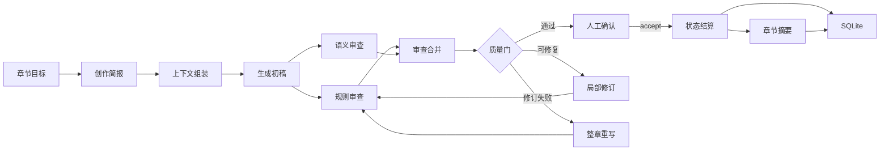
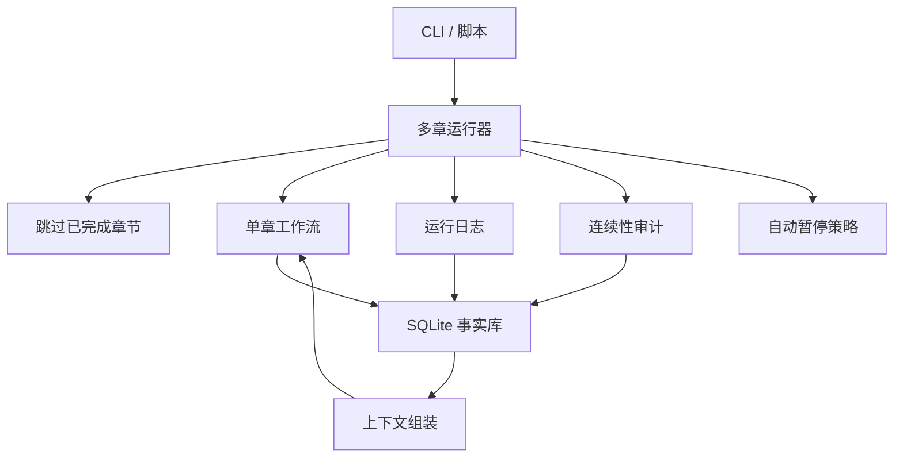
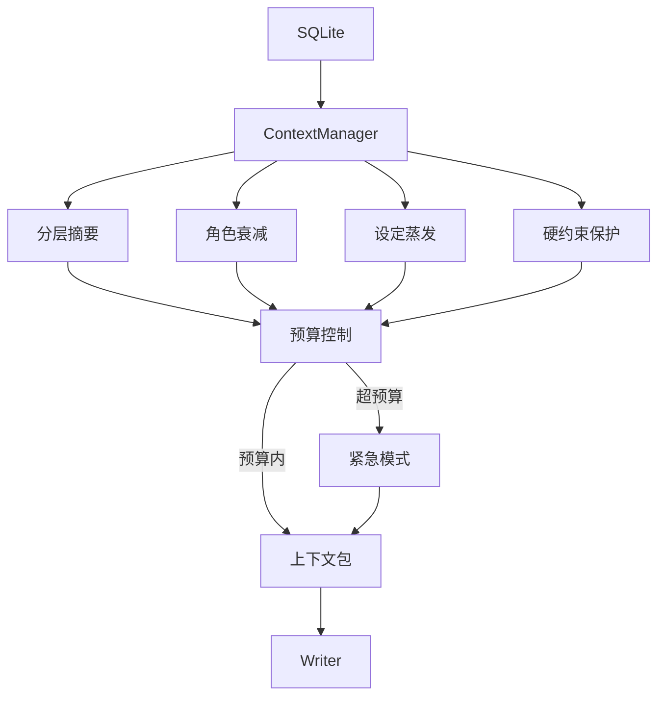

<div align="center">
  

  <h1>Songyan（松烟）</h1>

  <p><strong>多 Agent 中文长篇小说写作系统</strong></p>
  <p><em>松烟入墨，字句成锋。</em></p>
</div>

---

## 这是什么？

Songyan 是一个用多个 AI Agent 协作写中文长篇小说的系统。它不是"调用一次模型生成一章"的简单封装——而是把长篇写作拆成规划、生成、审查、修订、结算和连续性维护六个环节，每个环节由独立的 Agent 负责，共同维护一个长期事实数据库。

当前已在 **sci-fi 单一体裁**下稳定支持 **220 章**连续生成（220/220 accepted）。V8 阶段已把这一能力从科幻的隐式画像解耦，建立了可插拔的**体裁运行时画像（GenreRuntimeProfile）**——玄幻、武侠、都市三体裁在短窗口（10-15 章）已达到与科幻同等的完成度和质量基线；**玄幻（xuanhuan）更已完成 Ch100 中篇爬坡验证**（100/100 accepted，五门质量闸口全绿）。Profile 的全部运行时字段（预算分配、门禁阈值、蒸发曲线、角色衰减窗口、连续性容差）已接线到对应消费者，无 Profile 体裁 100% 回退旧行为。

### 它解决什么问题？

用单个模型直接写长篇会遇到三个核心困难：

1. **遗忘**：写到第 50 章时，模型已经不记得第 3 章发生了什么。
2. **质量漂移**：没有外部约束，文风、设定和角色行为会逐渐走样。
3. **事实不可信**：模型会"编造"角色状态变化，但无法保证前后一致。

Songyan 的做法是把"写文本"和"管事实"分开——Writer 只管生成正文，而角色状态、世界设定、伏笔线索、数字读数都由独立的结算模块从正文中提取、校验后存入 SQLite。这样，每一章的事实基础都是可追溯、可验证的。

---

## 核心设计

### 1. 生成与事实分离

这是 Songyan 最重要的设计决策。

大多数 AI 写作工具把模型输出当作最终结果。Songyan 把模型输出当作**候选材料**——正文可以自由发挥，但写入长期事实库的数据必须经过证据校验。

```
Writer 生成正文
    ↓
审查（规则 + 语义）→ 修订（最多两轮）
    ↓
人工确认 accept
    ↓
SettlementExtractor 从正文中提取：
  - 角色状态变化（old_value 必须匹配 DB 当前值）
  - 新设定（必须有正文 source_quote）
  - 伏笔（记录来源版本，后续追踪兑现）
  - 数字读数（公式闭合验证）
    ↓
写入 SQLite 长期事实库
```

这意味着：**模型可以提出候选信息，但事实库只接受有证据、可验证、可回放的数据。**

### 2. 上下文节食（Context Diet 2.0）

长篇生成的最大压力来自上下文膨胀。每写一章，历史信息就多一分，如果不加控制，prompt 会线性增长直到超出模型窗口。

Songyan 使用四组件协同控制：

| 组件 | 做法 | 效果 |
|------|------|------|
| 分层摘要 | 最近 5 章保留细节，远期压缩为弧摘要和卷摘要 | 历史信息从 O(n) 降到 O(log n) |
| 角色衰减 | 主角和当前出场角色保留完整档案；不活跃角色按未出场章数逐步降级为精简→符号→不加载 | 控制角色池膨胀 |
| 设定蒸发 | 低置信度、长期未使用的设定自动归档 | 防止设定累积 |
| 硬天花板 | 预算超限时触发紧急模式，只保留不可裁剪的硬约束 | 绝对上限保护 |

### 3. 多层审查而非单一评分

Songyan 不把质量判断交给一个模型。审查分为四层：

- **规则审查（RuleAuditor）**：代码级确定性检测——字数、Markdown 泄漏、段落重复、AI 腔特征词等。有就是有，没有就是没有。
- **语义审查（LLMAuditor）**：需要模型判断的问题——角色行为一致性、叙事节奏、信息密度。每个 critical/major issue 必须附带正文证据引用。
- **文学诊断（LiteraryAuditor）**：识别人物工具化、概念空转、过度平滑等文学性问题。只诊断，不阻塞。
- **合并与门禁（ReviewMerger + QualityGate）**：规则和语义审查结果合并后进入质量门——通过则 accept，有可修复问题则自动修订（最多两轮），修订不收敛则上报人工。

### 4. 版本不可覆盖

每次生成、修订、重写、人工编辑都会在 `chapter_versions` 表中创建新记录。不存在"覆盖"操作。这意味着：
- 任何版本都可以回溯
- 质量下降时可以回退到安全版本
- 完整审计链：谁在什么时候改了什么

### 5. 可中断、可恢复

长篇生成可能需要数小时。Songyan 支持：
- 中途 kill 后用 `--resume` 从断点继续
- 自动跳过已 accept 的章节
- 单章失败不阻塞整体（isolate 模式）
- 门禁检测到真实退化时自动暂停（AutoHalt），人工判断后继续

---

## 架构概览

### 单章工作流

每一章走完"规划 → 生成 → 审查 → 修订 → 确认 → 结算"的完整闭环：



### 多章运行



### 上下文管理



---

## 当前能力

Songyan 已经过 **sci-fi 220 章**和 **xuanhuan 100 章**的实战验证，**wuxia/urban 短窗口**质量同标也已达标。以下是已验证的关键能力：

| 能力 | 说明 |
|------|------|
| 长篇连续生成 | sci-fi 220/220 accepted；xuanhuan 100/100 accepted；0 halt |
| 多体裁可插拔 | `GenreRuntimeProfile` 全部运行时字段（预算/门禁/蒸发曲线/角色衰减/连续性容差）已按体裁接线到消费者；新增体裁只需新增 Profile 文件，不修改核心逻辑；无 Profile 体裁 100% 回退旧行为 |
| 文本洁净 | 零 Markdown 泄漏、零段落重复、零 AI 保护指令进入正文 |
| 事实一致性 | 角色状态、世界设定、数值读数均可追溯到正文证据 |
| 跨体裁一致性度量 | Consistency Error Density (CED) 按 consistency-only、merged/source、正文证据口径跨体裁公平比较 |
| 跨章连续性 | 孤立设定和遗忘伏笔自动检测；health 评分全程稳定 |
| 上下文控制 | Context Diet 2.0 四组件协同（分层摘要 / 角色衰减 / 设定蒸发 / 硬天花板）支撑 220+ 章不溢出 |
| 断点续跑 | kill 后 `--resume` 继续，自动跳过已完成章节 |
| 自适应门禁 | 正常波动不误伤，真实退化自动暂停（AutoHalt） |
| 叙事骨架 | 全书大纲 → 弧规划 → 章节目标自顶向下派生；xuanhuan 已用 9-arc/3-thread 骨架跑完 Ch100 |
| 伏笔调度 | 长程伏笔主动兑现，按体裁设 horizon floor（xuanhuan=48）防止长窗口 overdue 失控 |
| 文学护栏 | 配角目标、主动选择、概念预算在 prompt 和审查中双重约束；lexicon 按体裁参数化（xuanhuan/wuxia/urban 各一套） |
| 项目模板化 | `ProjectTemplate` 为 7 个体裁提供统一初始化入口，一键创建完整项目骨架 |

> 最新验证数据和进展见 [`docs/STATUS.md`](docs/STATUS.md)。

---

## 项目结构

```text
songyan/
├── src/songyan/
│   ├── agents/              # Writer / Auditor / RevisionHandler / SettlementExtractor 等
│   │   ├── context_manager/        # 上下文组装与预算控制
│   │   ├── creative_director/      # 创作简报与章节策略
│   │   ├── revision_handler/       # 局部 patch、分段修订、safe best 保护
│   │   └── settlement_extractor/   # 状态结算、证据校验、设定追踪
│   ├── workflows/           # LangGraph 单章闭环 + 多章运行器
│   ├── db/                  # SQLite schema、repository、迁移
│   ├── models/              # Pydantic v2 数据模型
│   ├── evals/               # 质量度量、文学诊断、护栏审计、CED 量具
│   └── llm/                 # LLM 调用、重试、结构化输出
├── genres/                  # 体裁 Profile JSON（scifi/xuanhuan/wuxia/urban 等 7 种）
├── prompts/cards/           # Agent 工艺卡（YAML 版本化）
├── tests/                   # 单元 / 集成 / E2E / 长序列测试
├── docs/                    # 状态、架构文档、报告
└── archive/                 # 历史资料
```

---

## 快速开始

### 环境要求

- Python >= 3.11
- DeepSeek API Key（或兼容 OpenAI 接口的 LLM）
- 磁盘空间：100 章数据库约 100MB，200 章约 160MB

### 安装

```bash
pip install -e ".[dev]"
cp .env.example .env
# 编辑 .env，填入 LLM_API_KEY
```

### 创建项目并生成

```bash
# 从体裁模板创建项目（支持 scifi/xuanhuan/wuxia/urban 等 7 种）
songyan create-project --template xuanhuan

# 生成第 1-5 章（自动确认模式）
songyan run --project-id <id> --chapters 1-5 --auto-confirm

# 断点续跑
songyan run --project-id <id> --chapters 1-100 --auto-confirm --resume
```

### 长跑脚本示例

```bash
# 初始化 DB + 从模板创建项目
$env:DATABASE_URL = "sqlite:///.tmp/myproject.db"
python scripts/run_172b_ch100_climb.py --init --template xuanhuan

# 无人值守跑 Ch1-Ch100（分段爬坡，自动 resume）
python scripts/run_172b_ch100_climb.py --to 100
```

---

## 技术栈

| 组件 | 选型 |
|------|------|
| 语言 | Python 3.11+（async/await） |
| 工作流 | LangGraph |
| 数据模型 | Pydantic v2 |
| 事实库 | SQLite + aiosqlite |
| LLM 接入 | LiteLLM |
| CLI | Click |
| 日志 | structlog |
| 测试 | pytest（2746 用例） |

---

## 开发文档

- [`docs/STATUS.md`](docs/STATUS.md) — 当前状态、五维验收证据、下一步
- [`docs/INDEX.md`](docs/INDEX.md) — 文档索引
- [`tasks/V8-README.md`](tasks/V8-README.md) — V8 任务事实入口（含编号治理规则）
- [`tasks/V7-README.md`](tasks/V7-README.md) — V7 历史任务事实（已收尾）
- [`tasks/172b-xuanhuan-ch100-climb.md`](tasks/172b-xuanhuan-ch100-climb.md) — xuanhuan Ch100 爬坡任务书
- [`docs/reports/172b-xuanhuan-ch100-climb.md`](docs/reports/172b-xuanhuan-ch100-climb.md) — xuanhuan Ch100 验收报告
- [`docs/reports/172a.7-genre-short-window-validation.md`](docs/reports/172a.7-genre-short-window-validation.md) — 多体裁短窗口验证报告
- [`AGENTS.md`](AGENTS.md) — 开发规范与工程纪律

---

## 许可证

AGPL-3.0 — 详见 [`LICENSE`](LICENSE)。
