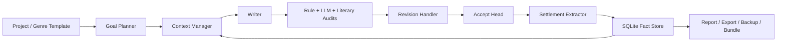

<div align="center">
  

  <h1>Songyan（松烟）</h1>

  <p><strong>Engineering-grade long-form Chinese fiction generation.</strong></p>
  <p><em>Plan the story. Write the chapter. Audit the facts. Keep the memory.</em></p>

  <p>
    <a href="https://www.python.org/">= 3.11" /></a>
    <a href="LICENSE"></a>
    <a href="https://github.com/Bingtuu/Songyan/actions/workflows/ci.yml"></a>
    <a href="https://github.com/astral-sh/ruff"></a>
    
    
  </p>
</div>

---

Songyan is a local-first Python CLI for building long Chinese novels with AI while keeping continuity, evidence and recovery under engineering control.

Unlike a one-shot writing prompt, Songyan treats each chapter as a governed pipeline:

```text
Plan -> Assemble context -> Draft -> Audit -> Revise -> Accept -> Extract facts -> Persist to SQLite
```

The model writes prose. Songyan manages memory, facts, versions, diagnostics and release-grade recovery paths.

## Why Songyan

Long-form AI writing fails when the system forgets old facts, silently mutates settings, or accepts unstable drafts without evidence. Songyan addresses that with:

| Problem | Songyan's answer |
|---------|------------------|
| Long novels exceed model context | Layered summaries, character focus, setting evaporation and budget guards |
| Characters and settings drift | SQLite fact store with evidence-backed settlement |
| Quality checks are subjective | Rule audits, semantic audits, literary diagnostics and quality gates |
| Long runs fail halfway | Run logs, resume support, failure recovery advice and diagnostic bundles |
| Local projects are hard to move | Backup / restore with schema and asset validation |
| Runtime tuning can break runs | Profile validate, dry-run, history and rollback |

## Current Status

Songyan is ready as a technical preview / release-candidate for external developers who are comfortable with Python, CLI workflows and LLM API configuration.

Validated project-level evidence:

- Sci-fi long-window baseline has been frozen at 200+ chapters.
- Xuanhuan, wuxia and urban samples completed 200 accepted chapters in internal validation.
- Wheel build, wheel-installed CLI, non-repository cwd, package resources, template project creation and accepted manuscript export have passed on Windows.
- CI covers ruff, runtime mypy, pytest, CLI tests and wheel smoke.

Before tagging a formal public release, maintainers should rerun the release checklist and a real LLM Ch1-3 smoke on the target release commit. See [Release Checklist](docs/release-checklist.md).

## Features

| Area | Capability |
|------|------------|
| Project creation | Create a complete project from packaged genre templates |
| Multi-genre runtime | Built-in profiles for sci-fi, xuanhuan, wuxia, urban and related templates |
| Chapter pipeline | Planning, drafting, auditing, revision, accept and fact extraction |
| Persistent memory | SQLite-backed projects, chapters, versions, settings, character state and run logs |
| Version history | Every draft / revision / accepted version is append-only |
| Context control | Dynamic budgets, layered summaries, focused character loading and emergency fallback |
| Failure recovery | Standardized advice for config, DB, preflight, run, report, export and restore errors |
| Diagnostics | `doctor`, `report`, redacted `bundle-run`, cost and quality signals |
| Asset lifecycle | `backup` / `restore` for project DB snapshots and metadata |
| Profile safety | `profile validate`, `upsert --dry-run`, `history`, `rollback` |
| Export | Clean Markdown / txt export from accepted chapters |

## Quickstart

### Requirements

- Python 3.11+
- A DeepSeek API key or another OpenAI-compatible LLM endpoint
- A writable local directory for SQLite DB, logs and exports

### Install for development

```powershell
python -m pip install -e ".[dev]"
Copy-Item .env.example .env
```

Edit `.env`:

```dotenv
LLM_API_KEY=your-api-key
LLM_BASE_URL=https://api.deepseek.com
LLM_MODEL=deepseek-chat
DATABASE_URL=sqlite:///songyan.db
CHECKPOINTER_MODE=sqlite
```

On Windows smoke runs, `CHECKPOINTER_MODE=memory` is often the simplest local setting.

### Run the shortest path

```powershell
# Check config, package resources and SQLite schema
songyan doctor --init-db

# Create a project from a packaged template
songyan create-project --template scifi

# Use the project_id printed by create-project
songyan run --project-id <project_id> --chapters 1-3 --auto-confirm

# Use the run_id printed by run
songyan report --run-id <run_id>
songyan bundle-run --run-id <run_id> --output bundles/

# Export accepted prose
songyan export --project-id <project_id> --chapters 1-3 --format md --output exports/

# Protect local project assets
songyan backup --project-id <project_id> --output backups/
```

For a longer walkthrough, see [Quickstart](docs/quickstart.md).

## Common Commands

| Command | Purpose |
|---------|---------|
| `songyan doctor --init-db` | Check environment and initialize / migrate SQLite |
| `songyan create-project --template <id>` | Create a project from a packaged template |
| `songyan list-projects` | List local projects |
| `songyan run --project-id <id> --chapters 1-3 --auto-confirm` | Run a short generation window |
| `songyan report --run-id <run_id>` | Render a run report from JSONL logs |
| `songyan bundle-run --run-id <run_id> --output bundles/` | Generate a redacted diagnostic bundle |
| `songyan export --project-id <id> --format md --output exports/` | Export accepted manuscript content |
| `songyan backup --project-id <id> --output backups/` | Create a restorable project asset package |
| `songyan restore --backup <zip> --database-url sqlite:///restored.db` | Restore a project DB from backup |
| `songyan profile validate --genre <genre> --json` | Validate effective runtime profile |
| `songyan profile upsert --genre <genre> --set key=value --dry-run` | Preview profile override without writing DB |
| `songyan profile history --genre <genre>` | Inspect profile mutation history |
| `songyan profile rollback --genre <genre> --history-id <id>` | Roll back a profile override |

## Architecture



Core packages:

| Path | Role |
|------|------|
| `src/songyan/agents/` | Planner, writer, auditors, revision and settlement agents |
| `src/songyan/workflows/` | Chapter and multi-chapter orchestration |
| `src/songyan/db/` | SQLite schema, migrations and repositories |
| `src/songyan/services/` | CLI-facing services: doctor, export, backup, bundle, profile |
| `src/songyan/genres/` | Packaged genre configuration |
| `src/songyan/project_templates/` | Packaged project templates |
| `src/songyan/prompts/` | Versioned prompt cards |
| `tests/` | Unit, integration and CLI tests |
| `docs/` | Public user and contributor documentation |

## Documentation

- [Status](docs/STATUS.md) - current release readiness and known limits
- [Quickstart](docs/quickstart.md) - install, configure and run
- [Troubleshooting](docs/troubleshooting.md) - recovery paths for common failures
- [Release Checklist](docs/release-checklist.md) - maintainer release gate
- [Minimal Reproduction Guide](docs/minimal-repro.md) - how to file useful issues
- [Documentation Index](docs/INDEX.md) - public documentation map
- [Changelog](CHANGELOG.md) - release notes
- [Contributing](CONTRIBUTING.md) - contribution workflow and boundaries

## Development

Run the standard checks before opening a PR:

```powershell
python -m pytest tests/ -q
python -m pytest tests/cli -q
ruff check src/ tests/
mypy src/
python -m pip wheel . --no-deps -w dist
```

On Windows, wrap long tests with a hard timeout:

```powershell
powershell -File scripts/run_with_timeout.ps1 -TimeoutSec 900 -- python -m pytest tests/ -q
```

Songyan's core invariants:

- SQLite is the long-term source of truth.
- Chapter versions are append-only.
- Agents do not write directly to DB connections; writes go through repository / service boundaries.
- Prompt cards stay in package resources, not inline code.
- Report-only research signals do not become runtime prompt, CED, T9 or hard-gate logic.

## Security and Privacy

Do not publish `.env`, API keys, raw private manuscripts, local DB files or unredacted logs.

When reporting a run failure, prefer:

```powershell
songyan bundle-run --run-id <run_id> --output bundles/
```

See [Minimal Reproduction Guide](docs/minimal-repro.md).

## License

Songyan is licensed under [AGPL-3.0](LICENSE).
