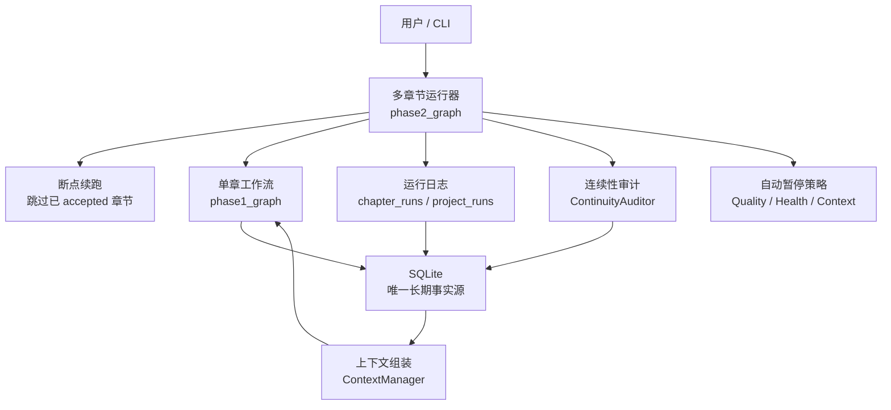
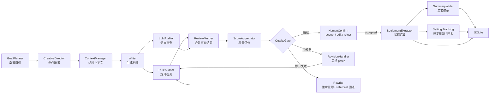
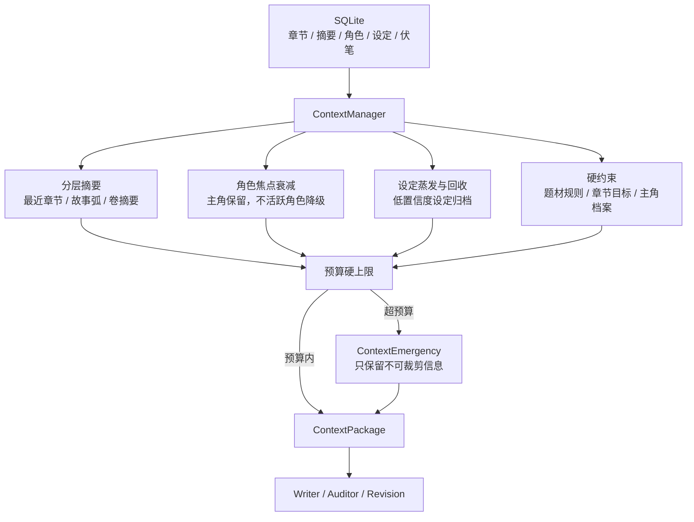

<div align="center">
  

  <h1>Songyan（松烟）</h1>

  <p><strong>多 Agent 中文小说写作系统</strong></p>
  <p><em>松烟入墨，字句成锋。</em></p>
  <p>面向长篇中文小说创作的多 Agent AI 生产系统，基于 LangGraph 多 Agent 协作架构。</p>
</div>

## 项目状态

Songyan 已经从实验原型推进到可长篇运行的工程版本。系统现在可以完成小说章节生成、自动审查、自动修订、状态结算、摘要沉淀和跨章节一致性维护，并已通过 150 章级别的长序列验证。

当前开发重点不再是“能不能连续生成”，而是“长篇生成后，系统记录下来的角色状态、设定、伏笔和数字信息是否可靠”。我们正在修补少量边界问题，确保系统不会把正文里没有明确证据的数字、设定或状态写进长期事实库。

README 只保留开源项目概览。实时开发状态、测试结果和下一步任务以 [`docs/STATUS.md`](docs/STATUS.md) 为准；完整任务记录见 [`tasks/V5-README.md`](tasks/V5-README.md)。

### 阶段概览

| 阶段 | 解决的问题 | 对使用者意味着什么 |
|------|------------|--------------------|
| 早期版本 | 搭建“写作 → 审查 → 修订 → 记录状态”的基础流程 | 系统不只是生成文本，还会解释、检查并保存每章结果 |
| 长篇稳定性 | 处理历史信息越来越多、上下文越来越长的问题 | 可以连续生成几十章而不频繁丢失上下文 |
| 150 章验证 | 引入信息压缩、角色淡出、设定清理和预算保护 | 已验证可以支撑 150 章级别的长篇生成流程 |
| 质量加固 | 补充测试、质量门、严格模式和异常恢复 | 生成流程更稳定，失败时更容易定位原因 |
| 当前阶段 | 提升长期事实库的可信度 | 正在确保角色状态、世界设定和数字读数都来自正文证据 |

### 当前开发重点

1. 数字记录必须有正文证据：系统不能把推测出来的数值写入角色状态或世界状态。
2. 设定回收要更可靠：已经再次出现或已经失效的设定，应被正确刷新、归档或移除。
3. 验证使用隔离副本数据库：聚焦复跑问题章节，确认修复有效后再推进主线验证。

### 长期目标

当前已经完成 150 章级别的长篇验证。下一阶段的现实目标是推进到 **200 章以上稳定输出**；更长期的研究目标是评估 **300 章级别** 的连续生成能力。

这两个目标不会只按章节数判断。Songyan 更关注长篇运行后的事实源质量：角色状态是否可信、设定是否被正确回收、伏笔是否持续可追踪、数字记录是否有正文证据。只有生成链路和长期事实库同时稳定，才算真正达到 200+ / 300 章目标。

### V5.0 核心决策

**Context-on-Demand（检索架构）→ Context Diet 2.0（信息节食）**

```
V4.0: ContextManager 预组装大包 → BudgetPruner 裁剪 → 仍持续增长
V5.0: TemporalCompressor 分层摘要 + CharacterFocalDecay 角色衰减
       + SettingEvaporator 设定蒸发 + BudgetHardCeiling 硬天花板
       → 信息密度 O(log n) → 支撑 150+ 章
```

**四组件协同**:

| 组件 | 功能 | 解决什么问题 |
|------|------|-------------|
| **TemporalCompressor** | 金字塔分层摘要（最近 5 章详细 + 弧摘要 + 卷摘要）| 历史信息 O(n) → O(log n) |
| **CharacterFocalDecay** | 角色档案按未出场章数衰减（完整→精简→符号→不加载）| 活跃角色池膨胀 |
| **SettingEvaporator** | 设定按 resolve_confidence 蒸发 + embedding 合并 | 设定/伏笔累积 |
| **BudgetHardCeiling** | fullness_factor 0.7 + ContextEmergency | 绝对预算天花板 |

---

## 1. 设计方式、逻辑和结构

### 1.1 设计目标

Songyan 的目标不是“一次调用模型写一章”，而是把长篇小说生成拆成可控制、可审查、可恢复的工程流程。每一章都要回答四个问题：

1. 这一章为什么这样写？
2. 它是否违反了题材、节奏、人物和世界设定？
3. 修订后有没有引入新问题？
4. 哪些角色状态、设定、伏笔和摘要可以安全写入长期事实库？

因此，系统把“生成文本”和“沉淀事实”分开处理：Writer 只负责正文；审查、修订、质量门、结算、摘要和连续性审计分别由独立模块完成。SQLite 是唯一长期事实源，LangGraph state 只传递 ID，不保存正文或完整业务对象。

### 1.2 总体架构

Songyan 采用两层工作流：

- **单章工作流**：规划、生成、审查、修订、质量门、人工确认、状态结算。
- **多章运行器**：按章节范围运行单章工作流，负责跳过已完成章节、记录 run log、执行连续性审计、触发暂停策略和支持断点续跑。



### 1.3 单章生成闭环

单章工作流的核心是“先生成，再审查，再决定是否修订或接受”。只有通过质量门和人工确认的版本才会进入结算阶段。



### 1.4 长篇上下文管理

长篇生成不能无限制地把所有历史塞回 prompt。Songyan 使用 Context Diet 2.0 控制信息密度：近期内容保留细节，远期内容压缩，长期未出现的角色和设定逐步降级或归档。



### 1.5 事实源与证据边界

状态结算是系统最严格的部分。正文可以有文学表达，但写入事实库的数据必须有可追溯来源：

- **角色状态**：只新增快照，不覆盖历史；`old_value` 必须匹配数据库当前值。
- **新设定**：必须带有正文中的 `source_quote`，不能凭空创建。
- **伏笔**：记录来源版本，后续可追踪是否兑现或过期。
- **数字读数**：真实账本必须满足公式；仪表读数必须能在正文或引用中找到明确证据。
- **摘要**：只基于 accepted 正文和已通过的结算结果生成。
- **连续性审计**：定期扫描孤立设定、遗忘伏笔和状态冲突，作为后续章节规划和修复依据。

这条边界的目的很简单：模型可以提出候选信息，但长期事实库只接受有证据、可验证、可回放的数据。

### 1.6 关键设计原则

- **事实源优先**：SQLite 保存长期事实；工作流 state 只保存 ID 和路由信息。
- **职责分离**：Writer 写正文，Auditor 找问题，RevisionHandler 做局部修订，SettlementExtractor 做结算，SummaryWriter 写摘要。
- **证据驱动**：自动修订和状态结算都依赖明确证据；没有证据的问题不进入自动修复链路。
- **版本不可覆盖**：每次生成、修订、重写、人工编辑都会产生新版本，便于回滚和审计。
- **长篇优先**：上下文管理以 100+ 章为目标，宁可压缩和归档信息，也不让 prompt 无限膨胀。
- **可中断、可恢复**：多章节运行记录 run log，支持跳过 accepted 章节和从失败章节继续。

### 1.7 项目结构

```text
songyan/
├── creative_modes/          # 创作模式配置，如 webnovel / literary / hybrid
├── genres/                  # 题材配置，如 scifi / xuanhuan / urban
├── prompts/cards/           # Agent 工艺卡，YAML 版本化管理
├── src/songyan/
│   ├── cli/                 # CLI 入口
│   ├── agents/              # 生成、审查、修订、结算、摘要、连续性审计
│   │   ├── context_manager/          # 上下文组装与预算控制
│   │   ├── continuity_auditor/       # 跨章一致性与 health 分级
│   │   ├── creative_director/        # 创作简报与章节策略
│   │   ├── revision_handler/         # 局部 patch、分段修订、safe best 保护
│   │   ├── settlement_extractor/     # 状态结算、证据校验、设定追踪
│   │   └── setting_evaporator/       # 设定蒸发与归档
│   ├── workflows/           # LangGraph 编排与多章节运行器
│   │   ├── phase1_graph.py           # 单章闭环
│   │   ├── phase2_graph.py           # 多章节运行、断点续跑、AutoHalt
│   │   ├── _nodes.py                 # 工作流节点实现
│   │   ├── _gates.py                 # 候选硬门禁与 health gate
│   │   └── _run_logger.py            # 章节运行日志
│   ├── db/                  # SQLite schema、repository、迁移和生命周期清理
│   ├── models/              # Pydantic v2 数据模型
│   ├── rag/                 # RAG 检索、chunk、embedding、vector store
│   ├── llm/                 # LLM client、重试、JSON 解析
│   └── utils/               # 规则检测、节奏检测、文本工具
├── tests/                   # 单元、集成、E2E、长序列压力测试
├── docs/                    # 当前状态、索引和架构文档
├── tasks/                   # 任务事实记录和完成报告
└── archive/                 # 历史报告、旧计划、旧脚本和归档材料
```

---

## 2. 技术设计

### 2.1 技术栈

| 组件 | 选型 | 说明 |
|------|------|------|
| Python 3.11+ | 主语言 | 异步优先，核心流程使用 `async` / `await` |
| LangGraph | 工作流编排 | 组织单章生成闭环和多章节运行 |
| Pydantic v2 | 数据模型 | 对章节、审查、结算、上下文等结构化数据做类型校验 |
| SQLite + aiosqlite | 本地事实库 | 保存项目、章节版本、审查报告、角色状态、设定、摘要和 run log |
| LiteLLM / LangChain | LLM 接入 | 统一模型调用、重试和结构化输出解析 |
| Click | CLI | 提供项目创建、章节生成、报告查看等命令 |
| structlog | 日志 | 输出可检索的结构化运行日志 |
| pytest | 测试 | 覆盖单元、集成、E2E 和长序列稳定性测试 |

### 2.2 数据事实源设计

SQLite 是 Songyan 的唯一长期事实源。工作流运行时只在 state 中传递 ID，具体正文、审查报告和状态快照都从 SQLite 读取，避免 LangGraph state 变成不可控的大对象。

关键规则：

- LangGraph state 只存 `project_id`、`version_id`、`report_id` 等引用。
- 每次生成、修订、重写、人工编辑都会创建新的 `chapter_versions` 记录，禁止覆盖旧版本。
- 每个节点从 SQLite 加载输入，不依赖上游节点传递完整正文。
- `character_states` 是快照表，默认只新增记录，不覆盖历史状态。
- accepted head、settlement、summary 等关键写入必须在事务中完成，避免半提交。

### 2.3 版本管理

章节正文采用追加式版本管理。系统可以保留初稿、修订版、重写版、人工编辑版和最终接受版，并在质量下降时回退到安全版本。

| 类型 | 说明 | 谁创建 |
|------|------|--------|
| `draft` | AI 初稿 | Writer |
| `revision` | AI 修订版 | RevisionHandler |
| `rewrite` | AI 重写版 | rewrite_node |
| `accepted` | 人工确认版 | HumanConfirm |
| `edited` | 人工编辑版 | HumanConfirm |

### 2.4 审查体系

Songyan 使用多层审查，而不是把质量判断交给单个模型：

- **RuleAuditor**：代码级检测，覆盖字数、钩子、AI 腔、疲劳词、短段落比例、Markdown/HTML/元标记泄漏等确定性问题。
- **LLMAuditor**：语义审查，检查角色行为、叙事节奏、设定一致性、信息倾倒等需要模型判断的问题。
- **LiteraryAuditor**：文学性诊断，识别人物工具化、概念空转、过度平滑等问题；只诊断，不阻塞 accept。
- **ReviewMerger**：合并规则审查和语义审查结果，不调用 LLM，保证审查合并可预测。
- **QualityGate**：根据综合评分和章节位置动态调整阈值；低风险章节可降级接受，但会留下可追踪标记。
- **RevisionHandler / Rewrite**：优先做局部 patch；多轮修订仍不收敛时才进入整章重写，并保留 safe best 回退路径。
- **ContinuityAuditor**：跨章扫描孤立设定、遗忘伏笔和状态冲突，为长篇一致性提供反馈。

### 2.5 状态结算

每章只有在 accepted 后才执行状态结算。edit、reject、back 等动作不会触发 settlement，避免未确认正文污染事实库。

SettlementExtractor 负责把 accepted 正文转成结构化事实，但它不能凭空写入信息：

- 角色状态更新要求 `old_value` 与数据库当前值一致。
- 新设定必须有正文中的 `source_quote`。
- 伏笔必须记录来源版本，便于后续追踪。
- 数字类状态分为真实账本和读数快照：真实账本必须公式闭合；读数快照必须能在正文或引用中找到明确数字证据。
- 质量门失败但允许流程继续的章节会跳过 settlement，防止低置信正文写入长期事实源。
- 结算通过后，SummaryWriter 基于 accepted 正文和 settlement 结果生成结构化摘要。

### 2.6 上下文架构演进

长篇生成的主要压力来自上下文膨胀。ContextManager 负责根据当前章节目标组装 `ContextPackage`，并在预算内选择最有用的信息。

| 机制 | 作用 |
|------|------|
| 分层摘要 | 近期章节保留细节，远期内容压缩为故事弧和卷摘要 |
| 角色焦点衰减 | 主角和当前出场角色优先，不活跃角色逐步降级 |
| 设定蒸发 | 低置信度、长期未使用或已回收的设定逐步归档 |
| 硬约束保护 | 题材规则、章节目标、创作简报和主角档案不被裁剪 |
| 预算硬上限 | 超预算时触发 ContextEmergency，只保留不可裁剪信息 |

这套机制的目标是让长篇上下文增长接近可控，而不是随着章节数线性膨胀。

---

## 3. 开发历程

Songyan 的开发历程按能力演进划分，而不是按内部任务编号展开。详细任务记录见 [`tasks/V5-README.md`](tasks/V5-README.md)，历史资料见 [`archive/v5/INDEX.md`](archive/v5/INDEX.md)。

| 阶段 | 主要目标 | 已形成的能力 | 当前状态 |
|------|----------|--------------|----------|
| 原型闭环 | 验证多 Agent 写作流程是否可控 | 建立“章节规划 → 正文生成 → 审查 → 修订 → 状态结算”的基础闭环 | 已完成 |
| 长篇支撑 | 解决多章生成中的遗忘、节奏和一致性问题 | 引入 RAG、人工标记、分层摘要、伏笔和设定追踪 | 已完成 |
| 稳定长跑 | 让系统可以连续运行并定位失败原因 | 增加 run log、断点续跑、质量指标、上下文预算和重写保护 | 已完成 |
| 上下文优化 | 控制长篇项目中不断膨胀的历史信息 | 建立预算裁剪、角色生命周期、设定生命周期和质量门控 | 已完成 |
| 150 章验证 | 验证系统能否支撑长篇规模生成 | Context Diet 2.0、分层压缩、角色衰减、设定蒸发、预算硬上限通过长序列验证 | 已完成 |
| 质量加固 | 提升输出质量和失败恢复能力 | 补充系统性测试、严格模式、降级接受、safe best 回退和报告入口 | 已完成 |
| 事实源治理 | 确保长期记录的角色状态、设定和数字信息可信 | 强化 Settlement 证据校验、设定回收、连续性健康检查和副本 DB 聚焦复跑 | 进行中 |

---
## 4. 快速开始

### 前置要求

- **Python >= 3.11**（必须，`pyproject.toml` 中 `requires-python = ">=3.11"`)
- DeepSeek API Key 或兼容的 LLM API（通过 litellm 统一接口）
- 磁盘空间：100 章运行时 DB + JSONL 日志约 10MB

### 安装

```bash
# 安装
pip install -e ".[dev]"

# 配置环境变量
cp .env.example .env
# 编辑 .env，填入 LLM_API_KEY

# 创建项目
songyan create-project

# 列出项目
songyan list-projects

# 运行测试
pytest -k "not integration" -q
```

### 验证命令

```bash
pytest tests/ -q
# 最新测试基线见 docs/STATUS.md

ruff check src/ tests/
# 最新 lint 状态见 docs/STATUS.md
```

---

## 5. 已交付的关键能力

本节只列对外说明有价值、且已有明确验证证据的能力。实时测试数字和最新阻断以 [`docs/STATUS.md`](docs/STATUS.md) 为准。

| 能力 | 当前状态 | 证据入口 |
|------|----------|----------|
| 150 章长篇生成链路 | 已完成一次 Ch1-Ch150 全流程验证，150/150 章节成功 | `tasks/121q-safe-best-threshold-dynamic-fix-DONE.md` |
| 单章生成闭环 | 已支持章节目标、创作简报、上下文组装、正文生成、审查、修订、质量门和人工确认 | `src/songyan/workflows/phase1_graph.py` |
| 多章节运行与恢复 | 已支持章节范围运行、跳过已接受章节、run log、自动暂停和断点续跑 | `src/songyan/workflows/phase2_graph.py` |
| 上下文预算控制 | 已落地分层摘要、角色衰减、设定蒸发和预算硬上限，支撑长篇上下文压缩 | `tasks/120-v5-final-acceptance-DONE.md` |
| 质量审查体系 | 已包含规则审查、语义审查、文学性诊断、质量评分、局部修订和 safe best 回退 | `src/songyan/agents/` |
| 状态结算与摘要 | 已支持 accepted 后的角色状态、设定、伏笔、数值和摘要结算，并持续加强证据校验 | `tasks/138f-settlement-evidence-gated-numerical-extraction-DONE.md` |
| 连续性健康检查 | 已支持跨章扫描孤立设定、遗忘伏笔和状态冲突；当前仍在治理剩余边界问题 | `tasks/137-setting-recycling-closed-loop.md` |
| 自动化验证 | 已建立单元、集成、E2E 和长序列压力测试；最近全量测试见状态板 | `tests/`、`docs/STATUS.md` |

仍在治理的指标包括：剩余 orphan 设定、部分环境读数类状态结算、以及完整默认配置下的更大范围复跑。这些属于当前开发工作，不应写成已交付指标。

---
## 6. 当前阶段与下一步

Songyan 的长篇生成主链路已经完成工程验收；当前开发重点是继续提高长期事实库的可信度，尤其是角色状态、世界设定、伏笔和数字读数是否都来自正文证据。

近期工作主要集中在三件事：

1. 修复状态结算中的边界情况，避免模型推测出的数字进入事实库。
2. 改进设定回收和连续性审计，让长期未使用、已经失效或再次出现的设定能被正确处理。
3. 使用隔离的副本数据库做小窗口复跑，确认修复有效后再推进更大范围验证。

README 不维护实时任务状态。当前进度、测试结果和下一步执行项请查看 [`docs/STATUS.md`](docs/STATUS.md)；完整任务事实入口见 [`tasks/V5-README.md`](tasks/V5-README.md)。

---
## 7. CLI 常用命令

```bash
# 创建项目
songyan create-project

# 自动生成第 1-5 章
songyan run --project-id mynovel --chapters 1-5 --auto-confirm

# 断点续跑（从失败章节继续）
songyan run --project-id mynovel --chapters 3-5 --auto-confirm  # 前 2 章已生成，从 Ch3 继续

# 查看项目列表
songyan list-projects

# 添加人类标记
songyan mark-add --project-id mynovel --type character --target 角色名 --note "需要调整性格"

# 自定义创作模式
songyan run --project-id mynovel --chapters 1-5 --auto-confirm --mode-id literary
```

## 8. 恢复失败章节

Songyan 支持断点续跑（SQLite checkpoint）：

1. 查阅 `logs/` 目录下的 JSONL 运行日志，找到失败章节的 `chapter_number`
2. 使用 `--chapters` 参数从失败章节重新运行，系统自动检测已完成的章节并跳过

```bash
# 假设 Ch1-Ch3 已完成，Ch4 失败：
songyan run --project-id mynovel --chapters 4-30 --auto-confirm
```

Checkpointer 模式说明：
- `sqlite`：生产环境，持久化 checkpoint，支持断点续跑
- `memory`：测试环境，不写文件锁（推荐 Windows 验证时使用）

通过 `CHECKPOINTER_MODE` 环境变量切换。

## 开发文档

常用入口：

- `docs/STATUS.md` — 当前状态、测试口径和下一步。
- `docs/INDEX.md` — 文档索引。
- `tasks/V5-README.md` — 当前任务事实入口。
- `AGENTS.md` — 开发代理约束和工程规则。

架构参考：

- `docs/architecture/04-vibe-coding-engineering.md` — 工程实践说明。
- `docs/architecture/05-tech-reference.md` — 技术参考。
- `prompts/cards/` — Agent 工艺卡与 Prompt 版本。

历史归档：

- `archive/v5/INDEX.md` — V5 历史资料入口。
- `archive/v4/INDEX.md` — V4 历史资料入口。
- `archive/v3/INDEX.md` — V3 历史资料入口。

## 许可证

本项目采用 **AGPL-3.0** 许可证。

你可以自由使用、修改和分发本项目；如果你基于本项目提供网络服务，也需要按 AGPL-3.0 的要求公开相应修改源码。完整条款见 [`LICENSE`](LICENSE)。
